<!-- GENERATED:MODEL -->
---
tags: [odoo, enterprise, generated, model]
---

# helpdesk.ticket

- Module: [[docs/Enterprise Addons/helpdesk_stock/helpdesk_stock|helpdesk_stock]]
- Scope: Enterprise Addons
- Defined in module: extension only
- Source files: `models/helpdesk_ticket.py`
- Python classes: `HelpdeskTicket`

## Field footprint

- Detected fields: 8
- Field types: `Boolean` x 1, `Integer` x 2, `Many2many` x 2, `Many2one` x 2, `Selection` x 1
- Relation fields: 4

## Sample fields

- `has_partner_picking`: `Boolean` (compute `_compute_suitable_product_ids`)
- `lot_id`: `Many2one` (comodel `stock.lot`)
- `picking_ids`: `Many2many` (comodel `stock.picking`)
- `pickings_count`: `Integer` (comodel `Return Orders Count`, compute `_compute_pickings_count`)
- `product_id`: `Many2one` (comodel `product.product`)
- `replacement_count`: `Integer` (compute `_compute_replacement_count`)
- `suitable_product_ids`: `Many2many` (comodel `product.product`, compute `_compute_suitable_product_ids`)
- `tracking`: `Selection` (related `product_id.tracking`)

## Method hints

- Detected methods: 10
- Action methods: `action_create_replacement`, `action_view_pickings`, `action_view_replacements`
- Compute methods: `_compute_display_extra_info`, `_compute_pickings_count`, `_compute_replacement_count`, `_compute_suitable_product_ids`
- Onchange methods: `_compute_display_extra_info`, `onchange_product_id`

## Direct relation diagram

```plantuml
@startuml
!define ODOO_COLOR_PRIMARY #714B67
!define ODOO_COLOR_ACCENT #875A7B
!define ODOO_COLOR_BG #FAF7FA

skinparam backgroundColor ODOO_COLOR_BG
skinparam defaultTextAlignment left
skinparam ArrowColor ODOO_COLOR_ACCENT
skinparam ClassBackgroundColor white
skinparam ClassBorderColor ODOO_COLOR_PRIMARY
skinparam ComponentBackgroundColor white
skinparam ComponentBorderColor ODOO_COLOR_PRIMARY
skinparam NoteBackgroundColor #FFF8FF
skinparam NoteBorderColor ODOO_COLOR_ACCENT
skinparam SequenceLifeLineBorderColor ODOO_COLOR_ACCENT
skinparam SequenceLifeLineBackgroundColor #FFFFFF
skinparam SequenceParticipantBorderColor ODOO_COLOR_PRIMARY
skinparam SequenceParticipantBackgroundColor #FFFFFF
skinparam sequence {
  ArrowColor ODOO_COLOR_ACCENT
  ActorBorderColor ODOO_COLOR_PRIMARY
}
title helpdesk.ticket - Direct Relations
class "helpdesk.ticket" as helpdesk_ticket
class "product.product" as product_product
class "stock.lot" as stock_lot
class "stock.picking" as stock_picking
helpdesk_ticket --> product_product : product_id
helpdesk_ticket .. product_product : suitable_product_ids
helpdesk_ticket --> stock_lot : lot_id
helpdesk_ticket .. stock_picking : picking_ids
@enduml
```

## Navigation

- **Parent:** [[docs/Enterprise Addons/helpdesk_stock/Models]]

<!-- GENERATED:MODEL -->
