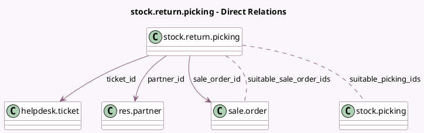

<!-- GENERATED:MODEL -->
---
tags: [odoo, enterprise, generated, model]
---

# stock.return.picking

- Module: [[docs/Enterprise Addons/helpdesk_stock/helpdesk_stock|helpdesk_stock]]
- Scope: Enterprise Addons
- Defined in module: extension only
- Source files: `wizard/stock_picking_return.py`
- Python classes: `StockReturnPicking`

## Field footprint

- Detected fields: 6
- Field types: `Many2many` x 2, `Many2one` x 4
- Relation fields: 6

## Sample fields

- `partner_id`: `Many2one` (comodel `res.partner`, related `ticket_id.partner_id`)
- `picking_id`: `Many2one` (compute `_compute_picking_id`, store `True`)
- `sale_order_id`: `Many2one` (comodel `sale.order`, compute `_compute_sale_order_id`)
- `suitable_picking_ids`: `Many2many` (comodel `stock.picking`, compute `_compute_suitable_picking_ids`)
- `suitable_sale_order_ids`: `Many2many` (comodel `sale.order`, compute `_compute_suitable_sale_orders`)
- `ticket_id`: `Many2one` (comodel `helpdesk.ticket`)

## Method hints

- Detected methods: 6
- Action methods: none
- Compute methods: `_compute_picking_id`, `_compute_sale_order_id`, `_compute_suitable_picking_ids`, `_compute_suitable_sale_orders`
- Onchange methods: none

## Direct relation diagram

## Navigation

- **Parent:** [[docs/Enterprise Addons/helpdesk_stock/Models]]

<!-- GENERATED:MODEL -->
