<!-- GENERATED:MODEL -->
---
tags: [odoo, enterprise, generated, model]
---

# account.move.reversal

- Module: [[docs/Enterprise Addons/helpdesk_stock_account/helpdesk_stock_account|helpdesk_stock_account]]
- Scope: Enterprise Addons
- Defined in module: extension only
- Source files: `wizard/account_move_reversal.py`
- Python classes: `AccountMoveReversal`

## Field footprint

- Detected fields: 4
- Field types: `Many2many` x 1, `Many2one` x 2, `Selection` x 1
- Relation fields: 3

## Sample fields

- `lot_id`: `Many2one` (related `helpdesk_ticket_id.lot_id`)
- `product_id`: `Many2one` (related `helpdesk_ticket_id.product_id`)
- `suitable_product_ids`: `Many2many` (related `helpdesk_ticket_id.suitable_product_ids`)
- `tracking`: `Selection` (related `product_id.tracking`)

## Method hints

- Detected methods: 5
- Action methods: none
- Compute methods: none
- Onchange methods: none

## Direct relation diagram

```plantuml
@startuml
!define ODOO_COLOR_PRIMARY #714B67
!define ODOO_COLOR_ACCENT #875A7B
!define ODOO_COLOR_BG #FAF7FA

skinparam backgroundColor ODOO_COLOR_BG
skinparam defaultTextAlignment left
skinparam ArrowColor ODOO_COLOR_ACCENT
skinparam ClassBackgroundColor white
skinparam ClassBorderColor ODOO_COLOR_PRIMARY
skinparam ComponentBackgroundColor white
skinparam ComponentBorderColor ODOO_COLOR_PRIMARY
skinparam NoteBackgroundColor #FFF8FF
skinparam NoteBorderColor ODOO_COLOR_ACCENT
skinparam SequenceLifeLineBorderColor ODOO_COLOR_ACCENT
skinparam SequenceLifeLineBackgroundColor #FFFFFF
skinparam SequenceParticipantBorderColor ODOO_COLOR_PRIMARY
skinparam SequenceParticipantBackgroundColor #FFFFFF
skinparam sequence {
  ArrowColor ODOO_COLOR_ACCENT
  ActorBorderColor ODOO_COLOR_PRIMARY
}
title account.move.reversal - Direct Relations
class "account.move.reversal" as account_move_reversal
@enduml
```

## Navigation

- **Parent:** [[docs/Enterprise Addons/helpdesk_stock_account/Models]]

<!-- GENERATED:MODEL -->
