<!-- GENERATED:MODEL -->
---
tags: [odoo, enterprise, generated, model]
---

# account.analytic.line

- Module: [[docs/Enterprise Addons/helpdesk_timesheet/helpdesk_timesheet|helpdesk_timesheet]]
- Scope: Enterprise Addons
- Defined in module: extension only
- Source files: `models/account_analytic_line.py`
- Python classes: `AccountAnalyticLine`

## Field footprint

- Detected fields: 4
- Field types: `Boolean` x 2, `Many2one` x 2
- Relation fields: 2

## Sample fields

- `display_task`: `Boolean` (compute `_compute_display_task`)
- `has_helpdesk_team`: `Boolean` (related `project_id.has_helpdesk_team`)
- `helpdesk_ticket_id`: `Many2one` (comodel `helpdesk.ticket`, compute `_compute_helpdesk_ticket_id`, store `True`)
- `project_id`: `Many2one`

## Method hints

- Detected methods: 20
- Action methods: none
- Compute methods: `_compute_display_task`, `_compute_helpdesk_ticket_id`, `_compute_partner_id`, `_compute_project_id`, `_compute_task_id`
- Onchange methods: `_onchange_project_id`

## Direct relation diagram

```plantuml
@startuml
!define ODOO_COLOR_PRIMARY #714B67
!define ODOO_COLOR_ACCENT #875A7B
!define ODOO_COLOR_BG #FAF7FA

skinparam backgroundColor ODOO_COLOR_BG
skinparam defaultTextAlignment left
skinparam ArrowColor ODOO_COLOR_ACCENT
skinparam ClassBackgroundColor white
skinparam ClassBorderColor ODOO_COLOR_PRIMARY
skinparam ComponentBackgroundColor white
skinparam ComponentBorderColor ODOO_COLOR_PRIMARY
skinparam NoteBackgroundColor #FFF8FF
skinparam NoteBorderColor ODOO_COLOR_ACCENT
skinparam SequenceLifeLineBorderColor ODOO_COLOR_ACCENT
skinparam SequenceLifeLineBackgroundColor #FFFFFF
skinparam SequenceParticipantBorderColor ODOO_COLOR_PRIMARY
skinparam SequenceParticipantBackgroundColor #FFFFFF
skinparam sequence {
  ArrowColor ODOO_COLOR_ACCENT
  ActorBorderColor ODOO_COLOR_PRIMARY
}
title account.analytic.line - Direct Relations
class "account.analytic.line" as account_analytic_line
class "helpdesk.ticket" as helpdesk_ticket
account_analytic_line --> helpdesk_ticket : helpdesk_ticket_id
@enduml
```

## Navigation

- **Parent:** [[docs/Enterprise Addons/helpdesk_timesheet/Models]]

<!-- GENERATED:MODEL -->
