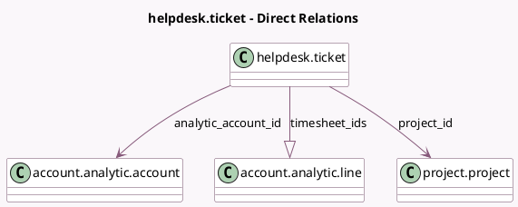

<!-- GENERATED:MODEL -->
---
tags: [odoo, enterprise, generated, model]
---

# helpdesk.ticket

- Module: [[docs/Enterprise Addons/helpdesk_timesheet/helpdesk_timesheet|helpdesk_timesheet]]
- Scope: Enterprise Addons
- Defined in module: yes
- Source files: `models/helpdesk_ticket.py`
- Python classes: `HelpdeskTicket`
- Inherits: `timer.parent.mixin`

## Field footprint

- Detected fields: 9
- Field types: `Boolean` x 3, `Float` x 2, `Many2one` x 3, `One2many` x 1
- Relation fields: 4

## Sample fields

- `analytic_account_id`: `Many2one` (comodel `account.analytic.account`, compute `_compute_analytic_account_id`, store `True`)
- `display_timesheet_timer`: `Boolean` (comodel `Display Timesheet Time`, compute `_compute_display_timesheet_timer`)
- `encode_uom_in_days`: `Boolean` (compute `_compute_encode_uom_in_days`)
- `project_id`: `Many2one` (comodel `project.project`, related `team_id.project_id`, store `True`)
- `team_id`: `Many2one`
- `timesheet_ids`: `One2many` (comodel `account.analytic.line`)
- `timesheet_unit_amount`: `Float` (compute `_compute_timesheet_unit_amount`)
- `total_hours_spent`: `Float` (comodel `Time Spent`, compute `_compute_total_hours_spent`, store `True`)
- `use_helpdesk_timesheet`: `Boolean` (comodel `Timesheet activated on Team`, related `team_id.use_helpdesk_timesheet`)

## Method hints

- Detected methods: 14
- Action methods: `action_timer_start`, `action_timer_stop`
- Compute methods: `_compute_analytic_account_id`, `_compute_display_extra_info`, `_compute_display_timesheet_timer`, `_compute_encode_uom_in_days`, `_compute_timesheet_unit_amount`, `_compute_total_hours_spent`
- Onchange methods: `_onchange_team_id`

## Direct relation diagram

## Navigation

- **Parent:** [[docs/Enterprise Addons/helpdesk_timesheet/Models]]

<!-- GENERATED:MODEL -->
