<!-- GENERATED:MODEL -->
---
tags: [odoo, enterprise, generated, model]
---

# project.project

- Module: [[docs/Enterprise Addons/helpdesk_timesheet/helpdesk_timesheet|helpdesk_timesheet]]
- Scope: Enterprise Addons
- Defined in module: extension only
- Source files: `models/project_project.py`
- Python classes: `ProjectProject`

## Field footprint

- Detected fields: 4
- Field types: `Boolean` x 1, `Integer` x 1, `One2many` x 2
- Relation fields: 2

## Sample fields

- `has_helpdesk_team`: `Boolean` (comodel `Has Helpdesk Teams`, compute `_compute_has_helpdesk_team`)
- `helpdesk_team`: `One2many` (comodel `helpdesk.team`)
- `ticket_count`: `Integer` (comodel `# Tickets`, compute `_compute_ticket_count`)
- `ticket_ids`: `One2many` (comodel `helpdesk.ticket`)

## Method hints

- Detected methods: 5
- Action methods: `action_open_project_tickets`
- Compute methods: `_compute_has_helpdesk_team`, `_compute_ticket_count`
- Onchange methods: none

## Direct relation diagram

```plantuml
@startuml
!define ODOO_COLOR_PRIMARY #714B67
!define ODOO_COLOR_ACCENT #875A7B
!define ODOO_COLOR_BG #FAF7FA

skinparam backgroundColor ODOO_COLOR_BG
skinparam defaultTextAlignment left
skinparam ArrowColor ODOO_COLOR_ACCENT
skinparam ClassBackgroundColor white
skinparam ClassBorderColor ODOO_COLOR_PRIMARY
skinparam ComponentBackgroundColor white
skinparam ComponentBorderColor ODOO_COLOR_PRIMARY
skinparam NoteBackgroundColor #FFF8FF
skinparam NoteBorderColor ODOO_COLOR_ACCENT
skinparam SequenceLifeLineBorderColor ODOO_COLOR_ACCENT
skinparam SequenceLifeLineBackgroundColor #FFFFFF
skinparam SequenceParticipantBorderColor ODOO_COLOR_PRIMARY
skinparam SequenceParticipantBackgroundColor #FFFFFF
skinparam sequence {
  ArrowColor ODOO_COLOR_ACCENT
  ActorBorderColor ODOO_COLOR_PRIMARY
}
title project.project - Direct Relations
class "project.project" as project_project
class "helpdesk.team" as helpdesk_team
class "helpdesk.ticket" as helpdesk_ticket
project_project --|> helpdesk_ticket : ticket_ids
project_project --|> helpdesk_team : helpdesk_team
@enduml
```

## Navigation

- **Parent:** [[docs/Enterprise Addons/helpdesk_timesheet/Models]]

<!-- GENERATED:MODEL -->
