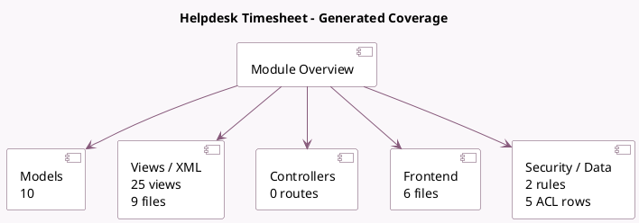

<!-- GENERATED:MODULE -->
---
tags: [odoo, enterprise, module]
---

# Helpdesk Timesheet

- Scope: Enterprise Addons
- Source: enterprise/helpdesk_timesheet
- Dependencies: [[docs/Enterprise Addons/timesheet_grid/timesheet_grid|timesheet_grid]], [[docs/Enterprise Addons/project_helpdesk/project_helpdesk|project_helpdesk]]

## Summary

Project, Tasks, Timesheet

## Generated coverage

- Models: 10
- XML files with UI/data artifacts: 9
- Views: 25
- Actions: 11
- Menus: 0
- Rules (ir.rule): 2
- Access CSV entries: 5
- Controller units: 0
- Frontend asset files: 6

## Module map

## Detail notes

- Models: [[docs/Enterprise Addons/helpdesk_timesheet/Models|Models]] (10)
- Views and XML: [[docs/Enterprise Addons/helpdesk_timesheet/Views|Views]] (9 files)
- Frontend: [[docs/Enterprise Addons/helpdesk_timesheet/Frontend|Frontend]] (6 files)

## Key models

- `account.analytic.line`
- `helpdesk.sla.report.analysis`
- `helpdesk.team`
- `helpdesk.ticket`
- `helpdesk.ticket.convert.wizard`
- `helpdesk.ticket.report.analysis`
- `hr_timesheet.merge.wizard`
- `project.project`
- `project.task.convert.wizard`
- `timesheets.analysis.report`

## Navigation

- [[../Enterprise Addons/Enterprise Addons|Back to scope]]
- [[../../docs/docs|Back to docs]]

<!-- GENERATED:MODULE -->

