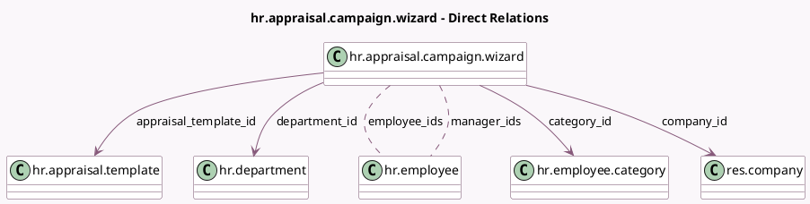

<!-- GENERATED:MODEL -->
---
tags: [odoo, enterprise, generated, model]
---

# hr.appraisal.campaign.wizard

- Module: [[docs/Enterprise Addons/hr_appraisal/hr_appraisal|hr_appraisal]]
- Scope: Enterprise Addons
- Defined in module: yes
- Source files: `wizard/hr_appraisal_campaign_wizard.py`
- Python classes: `HrAppraisalCampaignWizard`
- Description: Appraisal Campaign Wizard
- Inherits: `hr.mixin`

## Field footprint

- Detected fields: 10
- Field types: `Char` x 1, `Date` x 1, `Many2many` x 2, `Many2one` x 4, `Selection` x 2
- Relation fields: 6

## Sample fields

- `appraisal_date`: `Date`
- `appraisal_template_id`: `Many2one` (comodel `hr.appraisal.template`)
- `category_id`: `Many2one` (comodel `hr.employee.category`)
- `company_id`: `Many2one` (comodel `res.company`)
- `department_id`: `Many2one` (comodel `hr.department`)
- `employee_ids`: `Many2many` (comodel `hr.employee`)
- `manager`: `Selection`
- `manager_ids`: `Many2many` (comodel `hr.employee`)
- `mode`: `Selection`
- `warning`: `Char` (compute `_compute_warning`)

## Method hints

- Detected methods: 6
- Action methods: `action_generate_appraisals`
- Compute methods: `_compute_warning`
- Onchange methods: none

## Direct relation diagram

## Navigation

- **Parent:** [[docs/Enterprise Addons/hr_appraisal/Models]]

<!-- GENERATED:MODEL -->
