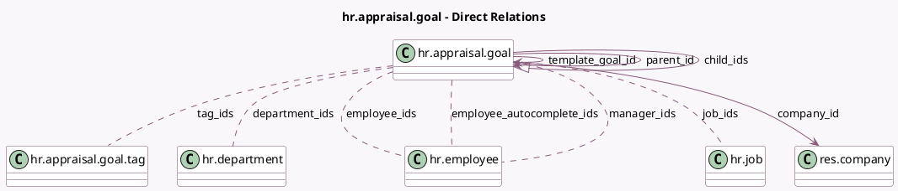

<!-- GENERATED:MODEL -->
---
tags: [odoo, enterprise, generated, model]
---

# hr.appraisal.goal

- Module: [[docs/Enterprise Addons/hr_appraisal/hr_appraisal|hr_appraisal]]
- Scope: Enterprise Addons
- Defined in module: yes
- Source files: `models/hr_appraisal_goal.py`
- Python classes: `HrAppraisalGoal`
- Description: Appraisal Goal
- Inherits: `hr.mixin`, `mail.activity.mixin`, `mail.thread`

## Field footprint

- Detected fields: 22
- Field types: `Boolean` x 3, `Char` x 2, `Date` x 1, `Float` x 1, `Html` x 1, `Integer` x 3, `Many2many` x 6, `Many2one` x 3, `One2many` x 1, `Selection` x 1
- Relation fields: 10

## Sample fields

- `active`: `Boolean`
- `child_ids`: `One2many` (comodel `hr.appraisal.goal`)
- `company_id`: `Many2one` (comodel `res.company`, related `employee_ids.company_id`, store `True`)
- `deadline`: `Date`
- `department_ids`: `Many2many` (comodel `hr.department`, compute `_compute_department_ids`, store `True`)
- `description`: `Html`
- `employee_autocomplete_ids`: `Many2many` (comodel `hr.employee`, compute `_compute_employee_autocomplete`)
- `employee_ids`: `Many2many` (comodel `hr.employee`)
- `has_edit_right`: `Boolean` (compute `_compute_has_edit_right`)
- `is_manager`: `Boolean` (compute `_compute_is_manager`)
- `job_ids`: `Many2many` (comodel `hr.job`, compute `_compute_job_ids`, store `True`)
- `manager_ids`: `Many2many` (comodel `hr.employee`, compute `_compute_manager_ids`, store `True`)
- `name`: `Char`
- `number_of_completed_sibling_goals`: `Integer` (compute `compute_number_of_completed_sibling_goals`, store `True`)
- `number_of_sibling_goals`: `Integer` (compute `_compute_number_of_sibling_goals`, store `True`)
- `parent_id`: `Many2one` (comodel `hr.appraisal.goal`)
- `parent_path`: `Char`
- `progression`: `Selection` (compute `_compute_progression`, store `True`)
- `sibling_goals_ratio`: `Float` (compute `_compute_sibling_goals_ratio`, store `True`)
- `tag_ids`: `Many2many` (comodel `hr.appraisal.goal.tag`)

## Method hints

- Detected methods: 22
- Action methods: `action_archive`, `action_confirm`, `action_open_goal_template`, `action_save_as_template`, `action_select_employees`
- Compute methods: `_compute_department_ids`, `_compute_employee_autocomplete`, `_compute_has_edit_right`, `_compute_is_manager`, `_compute_job_ids`, `_compute_manager_ids`, `_compute_number_of_sibling_goals`, `_compute_progression`, and 1 more
- Onchange methods: none

## Direct relation diagram

## Navigation

- **Parent:** [[docs/Enterprise Addons/hr_appraisal/Models]]

<!-- GENERATED:MODEL -->
