<!-- GENERATED:MODEL -->
---
tags: [odoo, enterprise, generated, model]
---

# hr.appraisal

- Module: [[docs/Enterprise Addons/hr_appraisal/hr_appraisal|hr_appraisal]]
- Scope: Enterprise Addons
- Defined in module: yes
- Source files: `models/hr_appraisal.py`
- Python classes: `HrAppraisal`
- Description: Employee Appraisal
- Inherits: `hr.mixin`, `mail.activity.mixin`, `mail.thread`

## Field footprint

- Detected fields: 38
- Field types: `Boolean` x 10, `Date` x 2, `Html` x 7, `Image` x 4, `Integer` x 2, `Many2many` x 2, `Many2one` x 9, `Properties` x 1, `Selection` x 1
- Relation fields: 11

## Sample fields

- `accessible_employee_feedback`: `Html` (compute `_compute_accessible_employee_feedback`)
- `accessible_manager_feedback`: `Html` (compute `_compute_accessible_manager_feedback`)
- `active`: `Boolean`
- `appraisal_plan_posted`: `Boolean`
- `appraisal_properties`: `Properties` (comodel `Properties`)
- `appraisal_template_id`: `Many2one` (comodel `hr.appraisal.template`, compute `_compute_appraisal_template`, store `True`)
- `assessment_note`: `Many2one` (comodel `hr.appraisal.note`)
- `avatar_128`: `Image` (related `employee_id.avatar_128`)
- `avatar_1920`: `Image` (related `employee_id.avatar_1920`)
- `can_see_employee_publish`: `Boolean` (compute `_compute_buttons_display`)
- `can_see_manager_publish`: `Boolean` (compute `_compute_buttons_display`)
- `company_id`: `Many2one` (comodel `res.company`, related `employee_id.company_id`, store `True`)
- `date_close`: `Date`
- `department_id`: `Many2one` (comodel `hr.department`, compute `_compute_department_id`, store `True`)
- `duplicate_appraisal_id`: `Many2one` (comodel `hr.appraisal`, compute `_compute_duplicate_appraisal_id`, store `False`)
- `employee_appraisal_count`: `Integer` (related `employee_id.appraisal_count`)
- `employee_autocomplete_ids`: `Many2many` (comodel `hr.employee`, compute `_compute_employee_autocomplete`)
- `employee_feedback`: `Html` (compute `_compute_employee_feedback`, store `True`)
- `employee_feedback_published`: `Boolean`
- `employee_feedback_template`: `Html` (compute `_compute_feedback_templates`)

## Method hints

- Detected methods: 41
- Action methods: `action_back`, `action_calendar_event`, `action_confirm`, `action_done`, `action_open_appraisal_campaign_wizard`, `action_open_employee_appraisals`, `action_open_goals`, `action_send_appraisal_request`
- Compute methods: `_compute_accessible_employee_feedback`, `_compute_accessible_manager_feedback`, `_compute_appraisal_template`, `_compute_buttons_display`, `_compute_department_id`, `_compute_display_name`, `_compute_duplicate_appraisal_id`, `_compute_employee_autocomplete`, and 8 more
- Onchange methods: `_onchange_employee_id`

## Direct relation diagram

```plantuml
@startuml
!define ODOO_COLOR_PRIMARY #714B67
!define ODOO_COLOR_ACCENT #875A7B
!define ODOO_COLOR_BG #FAF7FA

skinparam backgroundColor ODOO_COLOR_BG
skinparam defaultTextAlignment left
skinparam ArrowColor ODOO_COLOR_ACCENT
skinparam ClassBackgroundColor white
skinparam ClassBorderColor ODOO_COLOR_PRIMARY
skinparam ComponentBackgroundColor white
skinparam ComponentBorderColor ODOO_COLOR_PRIMARY
skinparam NoteBackgroundColor #FFF8FF
skinparam NoteBorderColor ODOO_COLOR_ACCENT
skinparam SequenceLifeLineBorderColor ODOO_COLOR_ACCENT
skinparam SequenceLifeLineBackgroundColor #FFFFFF
skinparam SequenceParticipantBorderColor ODOO_COLOR_PRIMARY
skinparam SequenceParticipantBackgroundColor #FFFFFF
skinparam sequence {
  ArrowColor ODOO_COLOR_ACCENT
  ActorBorderColor ODOO_COLOR_PRIMARY
}
title hr.appraisal - Direct Relations
class "hr.appraisal" as hr_appraisal
class "hr.appraisal" as hr_appraisal
class "hr.appraisal.note" as hr_appraisal_note
class "hr.appraisal.template" as hr_appraisal_template
class "hr.department" as hr_department
class "hr.employee" as hr_employee
class "hr.job" as hr_job
class "res.company" as res_company
class "res.users" as res_users
hr_appraisal --> hr_employee : employee_id
hr_appraisal --> res_users : employee_user_id
hr_appraisal --> res_company : company_id
hr_appraisal --> hr_department : department_id
hr_appraisal --> hr_job : job_id
hr_appraisal --> hr_appraisal : last_appraisal_id
hr_appraisal --> hr_appraisal_template : appraisal_template_id
hr_appraisal .. hr_employee : manager_ids
hr_appraisal .. hr_employee : employee_autocomplete_ids
hr_appraisal --> hr_appraisal_note : assessment_note
hr_appraisal --> hr_appraisal : duplicate_appraisal_id
@enduml
```

## Navigation

- **Parent:** [[docs/Enterprise Addons/hr_appraisal/Models]]

<!-- GENERATED:MODEL -->
