<!-- GENERATED:MODEL -->
---
tags: [odoo, enterprise, generated, model]
---

# hr.appraisal.template

- Module: [[docs/Enterprise Addons/hr_appraisal/hr_appraisal|hr_appraisal]]
- Scope: Enterprise Addons
- Defined in module: yes
- Source files: `models/hr_appraisal_template.py`
- Python classes: `HrAppraisalTemplate`
- Description: Employee Appraisal Template

## Field footprint

- Detected fields: 6
- Field types: `Char` x 1, `Html` x 2, `Integer` x 1, `Many2many` x 1, `Many2one` x 1
- Relation fields: 2

## Sample fields

- `appraisal_employee_feedback_template`: `Html` (comodel `Employee Feedback`, store `True`)
- `appraisal_manager_feedback_template`: `Html` (comodel `Manager Feedback`, store `True`)
- `company_id`: `Many2one` (comodel `res.company`)
- `department_ids`: `Many2many` (comodel `hr.department`)
- `description`: `Char`
- `sequence`: `Integer`

## Method hints

- Detected methods: 1
- Action methods: none
- Compute methods: none
- Onchange methods: none

## Direct relation diagram

```plantuml
@startuml
!define ODOO_COLOR_PRIMARY #714B67
!define ODOO_COLOR_ACCENT #875A7B
!define ODOO_COLOR_BG #FAF7FA

skinparam backgroundColor ODOO_COLOR_BG
skinparam defaultTextAlignment left
skinparam ArrowColor ODOO_COLOR_ACCENT
skinparam ClassBackgroundColor white
skinparam ClassBorderColor ODOO_COLOR_PRIMARY
skinparam ComponentBackgroundColor white
skinparam ComponentBorderColor ODOO_COLOR_PRIMARY
skinparam NoteBackgroundColor #FFF8FF
skinparam NoteBorderColor ODOO_COLOR_ACCENT
skinparam SequenceLifeLineBorderColor ODOO_COLOR_ACCENT
skinparam SequenceLifeLineBackgroundColor #FFFFFF
skinparam SequenceParticipantBorderColor ODOO_COLOR_PRIMARY
skinparam SequenceParticipantBackgroundColor #FFFFFF
skinparam sequence {
  ArrowColor ODOO_COLOR_ACCENT
  ActorBorderColor ODOO_COLOR_PRIMARY
}
title hr.appraisal.template - Direct Relations
class "hr.appraisal.template" as hr_appraisal_template
class "hr.department" as hr_department
class "res.company" as res_company
hr_appraisal_template --> res_company : company_id
hr_appraisal_template .. hr_department : department_ids
@enduml
```

## Navigation

- **Parent:** [[docs/Enterprise Addons/hr_appraisal/Models]]

<!-- GENERATED:MODEL -->
