<!-- GENERATED:MODEL -->
---
tags: [odoo, enterprise, generated, model]
---

# hr.department

- Module: [[docs/Enterprise Addons/hr_appraisal/hr_appraisal|hr_appraisal]]
- Scope: Enterprise Addons
- Defined in module: extension only
- Source files: `models/hr_department.py`
- Python classes: `HrDepartment`

## Field footprint

- Detected fields: 3
- Field types: `Integer` x 1, `Many2many` x 1, `PropertiesDefinition` x 1
- Relation fields: 1

## Sample fields

- `appraisal_properties_definition`: `PropertiesDefinition` (comodel `Appraisal Properties`)
- `appraisal_template_ids`: `Many2many` (comodel `hr.appraisal.template`)
- `appraisals_to_process_count`: `Integer` (compute `_compute_appraisals_to_process`)

## Method hints

- Detected methods: 2
- Action methods: `action_open_appraisals`
- Compute methods: `_compute_appraisals_to_process`
- Onchange methods: none

## Direct relation diagram

```plantuml
@startuml
!define ODOO_COLOR_PRIMARY #714B67
!define ODOO_COLOR_ACCENT #875A7B
!define ODOO_COLOR_BG #FAF7FA

skinparam backgroundColor ODOO_COLOR_BG
skinparam defaultTextAlignment left
skinparam ArrowColor ODOO_COLOR_ACCENT
skinparam ClassBackgroundColor white
skinparam ClassBorderColor ODOO_COLOR_PRIMARY
skinparam ComponentBackgroundColor white
skinparam ComponentBorderColor ODOO_COLOR_PRIMARY
skinparam NoteBackgroundColor #FFF8FF
skinparam NoteBorderColor ODOO_COLOR_ACCENT
skinparam SequenceLifeLineBorderColor ODOO_COLOR_ACCENT
skinparam SequenceLifeLineBackgroundColor #FFFFFF
skinparam SequenceParticipantBorderColor ODOO_COLOR_PRIMARY
skinparam SequenceParticipantBackgroundColor #FFFFFF
skinparam sequence {
  ArrowColor ODOO_COLOR_ACCENT
  ActorBorderColor ODOO_COLOR_PRIMARY
}
title hr.department - Direct Relations
class "hr.department" as hr_department
class "hr.appraisal.template" as hr_appraisal_template
hr_department .. hr_appraisal_template : appraisal_template_ids
@enduml
```

## Navigation

- **Parent:** [[docs/Enterprise Addons/hr_appraisal/Models]]

<!-- GENERATED:MODEL -->
