<!-- GENERATED:MODEL -->
---
tags: [odoo, enterprise, generated, model]
---

# hr.employee

- Module: [[docs/Enterprise Addons/hr_appraisal/hr_appraisal|hr_appraisal]]
- Scope: Enterprise Addons
- Defined in module: extension only
- Source files: `models/hr_employee.py`
- Python classes: `HrEmployee`

## Field footprint

- Detected fields: 14
- Field types: `Boolean` x 2, `Date` x 2, `Integer` x 4, `Many2many` x 1, `Many2one` x 3, `One2many` x 1, `Selection` x 1
- Relation fields: 5

## Sample fields

- `appraisal_count`: `Integer` (compute `_compute_appraisal_count`, store `True`)
- `appraisal_ids`: `One2many` (comodel `hr.appraisal`)
- `can_request_appraisal`: `Boolean` (compute `_compute_can_request_appraisal`)
- `goals_count`: `Integer` (compute `_compute_goals_count`)
- `goals_ids`: `Many2many` (comodel `hr.appraisal.goal`)
- `is_last_appraisal_late`: `Boolean` (compute `_compute_last_ongoing_appraisal_date`)
- `last_appraisal_id`: `Many2one` (comodel `hr.appraisal`)
- `last_appraisal_state`: `Selection` (related `last_appraisal_id.state`)
- `last_ongoing_appraisal_date`: `Date` (compute `_compute_last_ongoing_appraisal_date`)
- `next_appraisal_date`: `Date` (compute `_compute_next_appraisal_date`, store `True`)
- `ongoing_appraisal_count`: `Integer` (compute `_compute_ongoing_appraisal_count`, store `True`)
- `parent_user_id`: `Many2one` (related `parent_id.user_id`)
- `related_partner_id`: `Many2one` (comodel `res.partner`, compute `_compute_related_partner`)
- `uncomplete_goals_count`: `Integer` (compute `_compute_uncomplete_goals_count`)

## Method hints

- Detected methods: 16
- Action methods: `action_open_employee_appraisals`, `action_open_goals`, `action_open_last_appraisal`, `action_send_appraisal_request`
- Compute methods: `_compute_appraisal_count`, `_compute_can_request_appraisal`, `_compute_goals_count`, `_compute_last_ongoing_appraisal_date`, `_compute_next_appraisal_date`, `_compute_ongoing_appraisal_count`, `_compute_related_partner`, `_compute_uncomplete_goals_count`
- Onchange methods: none

## Direct relation diagram

```plantuml
@startuml
!define ODOO_COLOR_PRIMARY #714B67
!define ODOO_COLOR_ACCENT #875A7B
!define ODOO_COLOR_BG #FAF7FA

skinparam backgroundColor ODOO_COLOR_BG
skinparam defaultTextAlignment left
skinparam ArrowColor ODOO_COLOR_ACCENT
skinparam ClassBackgroundColor white
skinparam ClassBorderColor ODOO_COLOR_PRIMARY
skinparam ComponentBackgroundColor white
skinparam ComponentBorderColor ODOO_COLOR_PRIMARY
skinparam NoteBackgroundColor #FFF8FF
skinparam NoteBorderColor ODOO_COLOR_ACCENT
skinparam SequenceLifeLineBorderColor ODOO_COLOR_ACCENT
skinparam SequenceLifeLineBackgroundColor #FFFFFF
skinparam SequenceParticipantBorderColor ODOO_COLOR_PRIMARY
skinparam SequenceParticipantBackgroundColor #FFFFFF
skinparam sequence {
  ArrowColor ODOO_COLOR_ACCENT
  ActorBorderColor ODOO_COLOR_PRIMARY
}
title hr.employee - Direct Relations
class "hr.employee" as hr_employee
class "hr.appraisal" as hr_appraisal
class "hr.appraisal.goal" as hr_appraisal_goal
class "res.partner" as res_partner
hr_employee --> res_partner : related_partner_id
hr_employee --|> hr_appraisal : appraisal_ids
hr_employee .. hr_appraisal_goal : goals_ids
hr_employee --> hr_appraisal : last_appraisal_id
@enduml
```

## Navigation

- **Parent:** [[docs/Enterprise Addons/hr_appraisal/Models]]

<!-- GENERATED:MODEL -->
