<!-- GENERATED:MODEL -->
---
tags: [odoo, enterprise, generated, model]
---

# hr.employee.public

- Module: [[docs/Enterprise Addons/hr_appraisal/hr_appraisal|hr_appraisal]]
- Scope: Enterprise Addons
- Defined in module: extension only
- Source files: `models/hr_employee_public.py`
- Python classes: `HrEmployeePublic`

## Field footprint

- Detected fields: 7
- Field types: `Boolean` x 1, `Date` x 2, `Integer` x 1, `Many2one` x 2, `Selection` x 1
- Relation fields: 2

## Sample fields

- `can_request_appraisal`: `Boolean` (compute `_compute_can_request_appraisal`)
- `last_appraisal_date`: `Date` (related `employee_id.last_appraisal_id.date_close`)
- `last_appraisal_id`: `Many2one` (comodel `hr.appraisal`, compute `_compute_last_appraisal_id`)
- `last_appraisal_state`: `Selection` (compute `_compute_last_appraisal_state`)
- `next_appraisal_date`: `Date` (compute `_compute_manager_only_fields`)
- `ongoing_appraisal_count`: `Integer`
- `parent_user_id`: `Many2one` (comodel `res.users`, compute `_compute_parent_user_id`)

## Method hints

- Detected methods: 8
- Action methods: `action_open_last_appraisal`, `action_send_appraisal_request`
- Compute methods: `_compute_can_request_appraisal`, `_compute_last_appraisal_id`, `_compute_last_appraisal_state`, `_compute_parent_user_id`
- Onchange methods: none

## Direct relation diagram

```plantuml
@startuml
!define ODOO_COLOR_PRIMARY #714B67
!define ODOO_COLOR_ACCENT #875A7B
!define ODOO_COLOR_BG #FAF7FA

skinparam backgroundColor ODOO_COLOR_BG
skinparam defaultTextAlignment left
skinparam ArrowColor ODOO_COLOR_ACCENT
skinparam ClassBackgroundColor white
skinparam ClassBorderColor ODOO_COLOR_PRIMARY
skinparam ComponentBackgroundColor white
skinparam ComponentBorderColor ODOO_COLOR_PRIMARY
skinparam NoteBackgroundColor #FFF8FF
skinparam NoteBorderColor ODOO_COLOR_ACCENT
skinparam SequenceLifeLineBorderColor ODOO_COLOR_ACCENT
skinparam SequenceLifeLineBackgroundColor #FFFFFF
skinparam SequenceParticipantBorderColor ODOO_COLOR_PRIMARY
skinparam SequenceParticipantBackgroundColor #FFFFFF
skinparam sequence {
  ArrowColor ODOO_COLOR_ACCENT
  ActorBorderColor ODOO_COLOR_PRIMARY
}
title hr.employee.public - Direct Relations
class "hr.employee.public" as hr_employee_public
class "hr.appraisal" as hr_appraisal
class "res.users" as res_users
hr_employee_public --> res_users : parent_user_id
hr_employee_public --> hr_appraisal : last_appraisal_id
@enduml
```

## Navigation

- **Parent:** [[docs/Enterprise Addons/hr_appraisal/Models]]

<!-- GENERATED:MODEL -->
