<!-- GENERATED:MODEL -->
---
tags: [odoo, enterprise, generated, model]
---

# request.appraisal

- Module: [[docs/Enterprise Addons/hr_appraisal/hr_appraisal|hr_appraisal]]
- Scope: Enterprise Addons
- Defined in module: yes
- Source files: `wizard/request_appraisal.py`
- Python classes: `RequestAppraisal`
- Description: Request an Appraisal
- Inherits: `mail.composer.mixin`

## Field footprint

- Detected fields: 5
- Field types: `Html` x 1, `Many2many` x 1, `Many2one` x 3
- Relation fields: 4

## Sample fields

- `appraisal_id`: `Many2one` (comodel `hr.appraisal`)
- `author_id`: `Many2one` (comodel `res.partner`)
- `employee_id`: `Many2one` (comodel `hr.employee`)
- `recipient_ids`: `Many2many` (comodel `res.partner`)
- `user_body`: `Html` (comodel `User Contents`)

## Method hints

- Detected methods: 9
- Action methods: `action_invite`
- Compute methods: `_compute_body`, `_compute_can_edit_body`, `_compute_render_model`, `_compute_subject`
- Onchange methods: none

## Direct relation diagram

```plantuml
@startuml
!define ODOO_COLOR_PRIMARY #714B67
!define ODOO_COLOR_ACCENT #875A7B
!define ODOO_COLOR_BG #FAF7FA

skinparam backgroundColor ODOO_COLOR_BG
skinparam defaultTextAlignment left
skinparam ArrowColor ODOO_COLOR_ACCENT
skinparam ClassBackgroundColor white
skinparam ClassBorderColor ODOO_COLOR_PRIMARY
skinparam ComponentBackgroundColor white
skinparam ComponentBorderColor ODOO_COLOR_PRIMARY
skinparam NoteBackgroundColor #FFF8FF
skinparam NoteBorderColor ODOO_COLOR_ACCENT
skinparam SequenceLifeLineBorderColor ODOO_COLOR_ACCENT
skinparam SequenceLifeLineBackgroundColor #FFFFFF
skinparam SequenceParticipantBorderColor ODOO_COLOR_PRIMARY
skinparam SequenceParticipantBackgroundColor #FFFFFF
skinparam sequence {
  ArrowColor ODOO_COLOR_ACCENT
  ActorBorderColor ODOO_COLOR_PRIMARY
}
title request.appraisal - Direct Relations
class "request.appraisal" as request_appraisal
class "hr.appraisal" as hr_appraisal
class "hr.employee" as hr_employee
class "res.partner" as res_partner
request_appraisal --> hr_appraisal : appraisal_id
request_appraisal --> res_partner : author_id
request_appraisal --> hr_employee : employee_id
request_appraisal .. res_partner : recipient_ids
@enduml
```

## Navigation

- **Parent:** [[docs/Enterprise Addons/hr_appraisal/Models]]

<!-- GENERATED:MODEL -->
