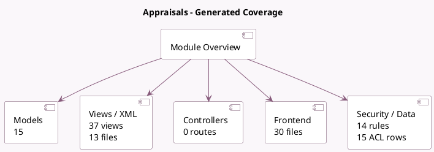

<!-- GENERATED:MODULE -->
---
tags: [odoo, enterprise, module]
---

# Appraisals

- Scope: Enterprise Addons
- Source: enterprise/hr_appraisal
- Dependencies: [[docs/Community Addons/calendar/calendar|calendar]], [[docs/Enterprise Addons/hr_gantt/hr_gantt|hr_gantt]]

## Summary

Assess your employees

## Generated coverage

- Models: 15
- XML files with UI/data artifacts: 13
- Views: 37
- Actions: 18
- Menus: 12
- Rules (ir.rule): 14
- Access CSV entries: 15
- Controller units: 0
- Frontend asset files: 30

## Module map

## Detail notes

- Models: [[docs/Enterprise Addons/hr_appraisal/Models|Models]] (15)
- Views and XML: [[docs/Enterprise Addons/hr_appraisal/Views|Views]] (13 files)
- Frontend: [[docs/Enterprise Addons/hr_appraisal/Frontend|Frontend]] (30 files)

## Key models

- `hr.appraisal`
- `hr.appraisal.campaign.wizard`
- `hr.appraisal.goal`
- `hr.appraisal.goal.tag`
- `hr.appraisal.note`
- `hr.appraisal.template`
- `hr.department`
- `hr.departure.wizard`
- `hr.employee`
- `hr.employee.public`
- `mail.template`
- `request.appraisal`

## Navigation

- [[../Enterprise Addons/Enterprise Addons|Back to scope]]
- [[../../docs/docs|Back to docs]]

<!-- GENERATED:MODULE -->

