<!-- GENERATED:MODEL -->
---
tags: [odoo, enterprise, generated, model]
---

# hr.appraisal

- Module: [[docs/Enterprise Addons/hr_appraisal_skills/hr_appraisal_skills|hr_appraisal_skills]]
- Scope: Enterprise Addons
- Defined in module: extension only
- Source files: `models/hr_appraisal.py`
- Python classes: `HrAppraisal`

## Field footprint

- Detected fields: 3
- Field types: `Many2one` x 1, `One2many` x 2
- Relation fields: 3

## Sample fields

- `appraisal_skill_ids`: `One2many` (comodel `hr.appraisal.skill`, compute `_compute_appraisal_skill_ids`, store `True`)
- `current_appraisal_skill_ids`: `One2many` (comodel `hr.appraisal.skill`, compute `_compute_current_appraisal_skill_ids`)
- `target_job_id`: `Many2one` (comodel `hr.job`)

## Method hints

- Detected methods: 6
- Action methods: none
- Compute methods: `_compute_appraisal_skill_ids`, `_compute_current_appraisal_skill_ids`
- Onchange methods: none

## Direct relation diagram

```plantuml
@startuml
!define ODOO_COLOR_PRIMARY #714B67
!define ODOO_COLOR_ACCENT #875A7B
!define ODOO_COLOR_BG #FAF7FA

skinparam backgroundColor ODOO_COLOR_BG
skinparam defaultTextAlignment left
skinparam ArrowColor ODOO_COLOR_ACCENT
skinparam ClassBackgroundColor white
skinparam ClassBorderColor ODOO_COLOR_PRIMARY
skinparam ComponentBackgroundColor white
skinparam ComponentBorderColor ODOO_COLOR_PRIMARY
skinparam NoteBackgroundColor #FFF8FF
skinparam NoteBorderColor ODOO_COLOR_ACCENT
skinparam SequenceLifeLineBorderColor ODOO_COLOR_ACCENT
skinparam SequenceLifeLineBackgroundColor #FFFFFF
skinparam SequenceParticipantBorderColor ODOO_COLOR_PRIMARY
skinparam SequenceParticipantBackgroundColor #FFFFFF
skinparam sequence {
  ArrowColor ODOO_COLOR_ACCENT
  ActorBorderColor ODOO_COLOR_PRIMARY
}
title hr.appraisal - Direct Relations
class "hr.appraisal" as hr_appraisal
class "hr.appraisal.skill" as hr_appraisal_skill
class "hr.job" as hr_job
hr_appraisal --> hr_job : target_job_id
hr_appraisal --|> hr_appraisal_skill : appraisal_skill_ids
hr_appraisal --|> hr_appraisal_skill : current_appraisal_skill_ids
@enduml
```

## Navigation

- **Parent:** [[docs/Enterprise Addons/hr_appraisal_skills/Models]]

<!-- GENERATED:MODEL -->
