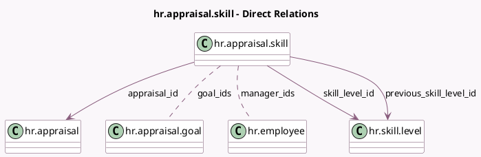

<!-- GENERATED:MODEL -->
---
tags: [odoo, enterprise, generated, model]
---

# hr.appraisal.skill

- Module: [[docs/Enterprise Addons/hr_appraisal_skills/hr_appraisal_skills|hr_appraisal_skills]]
- Scope: Enterprise Addons
- Defined in module: yes
- Source files: `models/hr_appraisal_skill.py`
- Python classes: `HrAppraisalSkill`
- Description: Appraisal Skills
- Inherits: `hr.individual.skill.mixin`

## Field footprint

- Detected fields: 10
- Field types: `Char` x 1, `Float` x 1, `Integer` x 2, `Many2many` x 2, `Many2one` x 4
- Relation fields: 6

## Sample fields

- `appraisal_id`: `Many2one` (comodel `hr.appraisal`)
- `employee_id`: `Many2one` (related `appraisal_id.employee_id`, store `True`)
- `goal_ids`: `Many2many` (comodel `hr.appraisal.goal`, compute `_compute_goal_ids`, store `True`)
- `goals_completion_percentage`: `Integer` (compute `_compute_goals_completion_percentage`, store `True`)
- `justification`: `Char`
- `manager_ids`: `Many2many` (comodel `hr.employee`, compute `_compute_manager_ids`, store `True`)
- `number_of_recommended_goals`: `Integer` (compute `_compute_number_of_recommended_goals`)
- `previous_skill_level_id`: `Many2one` (comodel `hr.skill.level`)
- `skill_level_id`: `Many2one` (comodel `hr.skill.level`)
- `target_job_skill_progress`: `Float` (compute `_compute_target_job_skill_progress`, store `True`)

## Method hints

- Detected methods: 11
- Action methods: `action_open_current_goals`, `action_open_recommend_goals`
- Compute methods: `_compute_display_name`, `_compute_goal_ids`, `_compute_goals_completion_percentage`, `_compute_manager_ids`, `_compute_number_of_recommended_goals`, `_compute_target_job_skill_progress`
- Onchange methods: none

## Direct relation diagram

## Navigation

- **Parent:** [[docs/Enterprise Addons/hr_appraisal_skills/Models]]

<!-- GENERATED:MODEL -->
