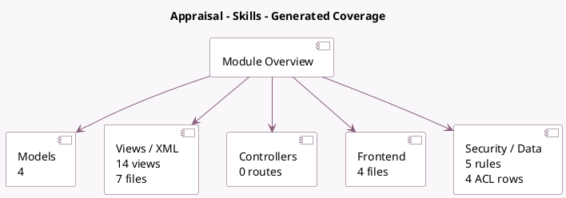

<!-- GENERATED:MODULE -->
---
tags: [odoo, enterprise, module]
---

# Appraisal - Skills

- Scope: Enterprise Addons
- Source: enterprise/hr_appraisal_skills
- Dependencies: [[docs/Enterprise Addons/hr_appraisal/hr_appraisal|hr_appraisal]], [[docs/Community Addons/hr_skills/hr_skills|hr_skills]]

## Summary

Manage skills of your employees during an appraisal process

## Generated coverage

- Models: 4
- XML files with UI/data artifacts: 7
- Views: 14
- Actions: 2
- Menus: 2
- Rules (ir.rule): 5
- Access CSV entries: 4
- Controller units: 0
- Frontend asset files: 4

## Module map

## Detail notes

- Models: [[docs/Enterprise Addons/hr_appraisal_skills/Models|Models]] (4)
- Views and XML: [[docs/Enterprise Addons/hr_appraisal_skills/Views|Views]] (7 files)
- Frontend: [[docs/Enterprise Addons/hr_appraisal_skills/Frontend|Frontend]] (4 files)

## Key models

- `hr.appraisal`
- `hr.appraisal.goal`
- `hr.appraisal.goal.skill`
- `hr.appraisal.skill`

## Navigation

- [[../Enterprise Addons/Enterprise Addons|Back to scope]]
- [[../../docs/docs|Back to docs]]

<!-- GENERATED:MODULE -->

