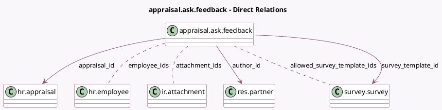

<!-- GENERATED:MODEL -->
---
tags: [odoo, enterprise, generated, model]
---

# appraisal.ask.feedback

- Module: [[docs/Enterprise Addons/hr_appraisal_survey/hr_appraisal_survey|hr_appraisal_survey]]
- Scope: Enterprise Addons
- Defined in module: yes
- Source files: `wizard/appraisal_ask_feedback.py`
- Python classes: `AppraisalAskFeedback`
- Description: Ask Feedback for Appraisal
- Inherits: `hr.mixin`, `mail.composer.mixin`

## Field footprint

- Detected fields: 10
- Field types: `Date` x 1, `Html` x 1, `Many2many` x 3, `Many2one` x 5
- Relation fields: 8

## Sample fields

- `allowed_survey_template_ids`: `Many2many` (comodel `survey.survey`, compute `_compute_allowed_survey_template_ids`)
- `appraisal_id`: `Many2one` (comodel `hr.appraisal`)
- `attachment_ids`: `Many2many` (comodel `ir.attachment`)
- `author_id`: `Many2one` (comodel `res.partner`)
- `deadline`: `Date` (compute `_compute_deadline`, store `True`)
- `employee_id`: `Many2one` (related `appraisal_id.employee_id`)
- `employee_ids`: `Many2many` (comodel `hr.employee`)
- `survey_template_id`: `Many2one` (comodel `survey.survey`, compute `_compute_survey_template_id`, store `True`)
- `template_id`: `Many2one`
- `user_body`: `Html` (comodel `User Contents`)

## Method hints

- Detected methods: 13
- Action methods: `action_save_as_template`, `action_send`
- Compute methods: `_compute_allowed_survey_template_ids`, `_compute_body`, `_compute_deadline`, `_compute_render_model`, `_compute_subject`, `_compute_survey_template_id`
- Onchange methods: `_onchange_employee_ids`, `_onchange_template_id`

## Direct relation diagram

## Navigation

- **Parent:** [[docs/Enterprise Addons/hr_appraisal_survey/Models]]

<!-- GENERATED:MODEL -->
