<!-- GENERATED:MODEL -->
---
tags: [odoo, enterprise, generated, model]
---

# appraisal.select.survey

- Module: [[docs/Enterprise Addons/hr_appraisal_survey/hr_appraisal_survey|hr_appraisal_survey]]
- Scope: Enterprise Addons
- Defined in module: yes
- Source files: `wizard/appraisal_select_survey.py`
- Python classes: `AppraisalSelectSurvey`
- Description: Select survey type for an appraisal to show its results

## Field footprint

- Detected fields: 3
- Field types: `Many2many` x 2, `Many2one` x 1
- Relation fields: 3

## Sample fields

- `allowed_survey_template_ids`: `Many2many` (comodel `survey.survey`, compute `_compute_allowed_survey_template_ids`)
- `survey_input_ids`: `Many2many` (comodel `survey.user_input`)
- `survey_template_id`: `Many2one` (comodel `survey.survey`, compute `_compute_survey_template_id`, store `True`)

## Method hints

- Detected methods: 3
- Action methods: `action_see_results`
- Compute methods: `_compute_allowed_survey_template_ids`, `_compute_survey_template_id`
- Onchange methods: none

## Direct relation diagram

```plantuml
@startuml
!define ODOO_COLOR_PRIMARY #714B67
!define ODOO_COLOR_ACCENT #875A7B
!define ODOO_COLOR_BG #FAF7FA

skinparam backgroundColor ODOO_COLOR_BG
skinparam defaultTextAlignment left
skinparam ArrowColor ODOO_COLOR_ACCENT
skinparam ClassBackgroundColor white
skinparam ClassBorderColor ODOO_COLOR_PRIMARY
skinparam ComponentBackgroundColor white
skinparam ComponentBorderColor ODOO_COLOR_PRIMARY
skinparam NoteBackgroundColor #FFF8FF
skinparam NoteBorderColor ODOO_COLOR_ACCENT
skinparam SequenceLifeLineBorderColor ODOO_COLOR_ACCENT
skinparam SequenceLifeLineBackgroundColor #FFFFFF
skinparam SequenceParticipantBorderColor ODOO_COLOR_PRIMARY
skinparam SequenceParticipantBackgroundColor #FFFFFF
skinparam sequence {
  ArrowColor ODOO_COLOR_ACCENT
  ActorBorderColor ODOO_COLOR_PRIMARY
}
title appraisal.select.survey - Direct Relations
class "appraisal.select.survey" as appraisal_select_survey
class "survey.survey" as survey_survey
class "survey.user_input" as survey_user_input
appraisal_select_survey .. survey_user_input : survey_input_ids
appraisal_select_survey .. survey_survey : allowed_survey_template_ids
appraisal_select_survey --> survey_survey : survey_template_id
@enduml
```

## Navigation

- **Parent:** [[docs/Enterprise Addons/hr_appraisal_survey/Models]]

<!-- GENERATED:MODEL -->
