<!-- GENERATED:MODEL -->
---
tags: [odoo, enterprise, generated, model]
---

# hr.appraisal

- Module: [[docs/Enterprise Addons/hr_appraisal_survey/hr_appraisal_survey|hr_appraisal_survey]]
- Scope: Enterprise Addons
- Defined in module: extension only
- Source files: `models/hr_appraisal.py`
- Python classes: `HrAppraisal`

## Field footprint

- Detected fields: 4
- Field types: `Integer` x 2, `Many2many` x 2
- Relation fields: 2

## Sample fields

- `completed_survey_count`: `Integer` (compute `_compute_completed_survey_count`)
- `employee_feedback_ids`: `Many2many` (comodel `hr.employee`)
- `survey_ids`: `Many2many` (comodel `survey.survey`)
- `total_survey_count`: `Integer` (compute `_compute_total_survey_count`)

## Method hints

- Detected methods: 7
- Action methods: `action_ask_feedback`, `action_open_all_survey_inputs`, `action_open_survey_inputs`
- Compute methods: `_compute_completed_survey_count`, `_compute_total_survey_count`
- Onchange methods: none

## Direct relation diagram

```plantuml
@startuml
!define ODOO_COLOR_PRIMARY #714B67
!define ODOO_COLOR_ACCENT #875A7B
!define ODOO_COLOR_BG #FAF7FA

skinparam backgroundColor ODOO_COLOR_BG
skinparam defaultTextAlignment left
skinparam ArrowColor ODOO_COLOR_ACCENT
skinparam ClassBackgroundColor white
skinparam ClassBorderColor ODOO_COLOR_PRIMARY
skinparam ComponentBackgroundColor white
skinparam ComponentBorderColor ODOO_COLOR_PRIMARY
skinparam NoteBackgroundColor #FFF8FF
skinparam NoteBorderColor ODOO_COLOR_ACCENT
skinparam SequenceLifeLineBorderColor ODOO_COLOR_ACCENT
skinparam SequenceLifeLineBackgroundColor #FFFFFF
skinparam SequenceParticipantBorderColor ODOO_COLOR_PRIMARY
skinparam SequenceParticipantBackgroundColor #FFFFFF
skinparam sequence {
  ArrowColor ODOO_COLOR_ACCENT
  ActorBorderColor ODOO_COLOR_PRIMARY
}
title hr.appraisal - Direct Relations
class "hr.appraisal" as hr_appraisal
class "hr.employee" as hr_employee
class "survey.survey" as survey_survey
hr_appraisal .. hr_employee : employee_feedback_ids
hr_appraisal .. survey_survey : survey_ids
@enduml
```

## Navigation

- **Parent:** [[docs/Enterprise Addons/hr_appraisal_survey/Models]]

<!-- GENERATED:MODEL -->
