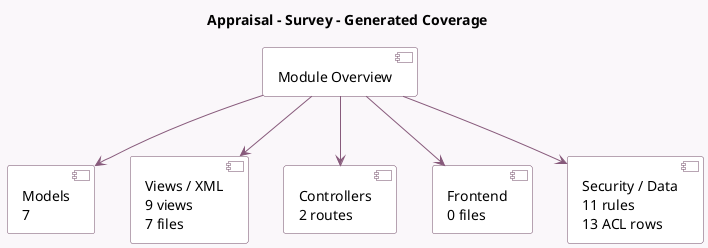

<!-- GENERATED:MODULE -->
---
tags: [odoo, enterprise, module]
---

# Appraisal - Survey

- Scope: Enterprise Addons
- Source: enterprise/hr_appraisal_survey
- Dependencies: [[docs/Enterprise Addons/hr_appraisal/hr_appraisal|hr_appraisal]], [[docs/Community Addons/survey/survey|survey]]

## Summary

360 Feedback

## Generated coverage

- Models: 7
- XML files with UI/data artifacts: 7
- Views: 9
- Actions: 2
- Menus: 1
- Rules (ir.rule): 11
- Access CSV entries: 13
- Controller units: 1
- Frontend asset files: 0

## Module map

## Detail notes

- Models: [[docs/Enterprise Addons/hr_appraisal_survey/Models|Models]] (7)
- Views and XML: [[docs/Enterprise Addons/hr_appraisal_survey/Views|Views]] (7 files)
- Controllers: [[docs/Enterprise Addons/hr_appraisal_survey/Controllers|Controllers]] (1)

## Key models

- `appraisal.ask.feedback`
- `appraisal.select.survey`
- `hr.appraisal`
- `hr.appraisal.template`
- `survey.question.answer`
- `survey.survey`
- `survey.user_input`

## Navigation

- [[../Enterprise Addons/Enterprise Addons|Back to scope]]
- [[../../docs/docs|Back to docs]]

<!-- GENERATED:MODULE -->

