<!-- GENERATED:MODEL -->
---
tags: [odoo, enterprise, generated, model]
---

# hr.applicant

- Module: [[docs/Enterprise Addons/hr_contract_salary/hr_contract_salary|hr_contract_salary]]
- Scope: Enterprise Addons
- Defined in module: extension only
- Source files: `models/hr_applicant.py`
- Python classes: `HrApplicant`

## Field footprint

- Detected fields: 4
- Field types: `Integer` x 2, `Many2many` x 1, `One2many` x 1
- Relation fields: 2

## Sample fields

- `proposed_contracts`: `Many2many` (comodel `hr.version`)
- `proposed_contracts_count`: `Integer` (compute `_compute_proposed_contracts_count`)
- `salary_offer_ids`: `One2many` (comodel `hr.contract.salary.offer`)
- `salary_offers_count`: `Integer` (compute `_compute_salary_offers_count`)

## Method hints

- Detected methods: 10
- Action methods: `action_generate_offer`, `action_show_offers`, `action_show_proposed_contracts`
- Compute methods: `_compute_proposed_contracts_count`, `_compute_salary_offers_count`
- Onchange methods: none

## Direct relation diagram

```plantuml
@startuml
!define ODOO_COLOR_PRIMARY #714B67
!define ODOO_COLOR_ACCENT #875A7B
!define ODOO_COLOR_BG #FAF7FA

skinparam backgroundColor ODOO_COLOR_BG
skinparam defaultTextAlignment left
skinparam ArrowColor ODOO_COLOR_ACCENT
skinparam ClassBackgroundColor white
skinparam ClassBorderColor ODOO_COLOR_PRIMARY
skinparam ComponentBackgroundColor white
skinparam ComponentBorderColor ODOO_COLOR_PRIMARY
skinparam NoteBackgroundColor #FFF8FF
skinparam NoteBorderColor ODOO_COLOR_ACCENT
skinparam SequenceLifeLineBorderColor ODOO_COLOR_ACCENT
skinparam SequenceLifeLineBackgroundColor #FFFFFF
skinparam SequenceParticipantBorderColor ODOO_COLOR_PRIMARY
skinparam SequenceParticipantBackgroundColor #FFFFFF
skinparam sequence {
  ArrowColor ODOO_COLOR_ACCENT
  ActorBorderColor ODOO_COLOR_PRIMARY
}
title hr.applicant - Direct Relations
class "hr.applicant" as hr_applicant
class "hr.contract.salary.offer" as hr_contract_salary_offer
class "hr.version" as hr_version
hr_applicant --|> hr_contract_salary_offer : salary_offer_ids
hr_applicant .. hr_version : proposed_contracts
@enduml
```

## Navigation

- **Parent:** [[docs/Enterprise Addons/hr_contract_salary/Models]]

<!-- GENERATED:MODEL -->
