<!-- GENERATED:MODEL -->
---
tags: [odoo, enterprise, generated, model]
---

# hr.contract.recruitment.report

- Module: [[docs/Enterprise Addons/hr_contract_salary/hr_contract_salary|hr_contract_salary]]
- Scope: Enterprise Addons
- Defined in module: yes
- Source files: `report/hr_contract_recruitment_report.py`
- Python classes: `HrContractRecruitmentReport`
- Description: Contract and Recruitment Analysis Report

## Field footprint

- Detected fields: 11
- Field types: `Date` x 1, `Integer` x 6, `Many2one` x 3, `Selection` x 1
- Relation fields: 3

## Sample fields

- `applicant_id`: `Many2one` (comodel `hr.applicant`)
- `cancelled`: `Integer`
- `expired`: `Integer`
- `fully_signed`: `Integer`
- `in_progress`: `Integer`
- `job_id`: `Many2one` (comodel `hr.job`)
- `offer_create_date`: `Date` (comodel `Offer Create Date`)
- `offer_id`: `Many2one` (comodel `hr.contract.salary.offer`)
- `offer_state`: `Selection`
- `partially_signed`: `Integer`
- `refused`: `Integer`

## Method hints

- Detected methods: 3
- Action methods: `action_open_applicant`
- Compute methods: none
- Onchange methods: none

## Direct relation diagram

```plantuml
@startuml
!define ODOO_COLOR_PRIMARY #714B67
!define ODOO_COLOR_ACCENT #875A7B
!define ODOO_COLOR_BG #FAF7FA

skinparam backgroundColor ODOO_COLOR_BG
skinparam defaultTextAlignment left
skinparam ArrowColor ODOO_COLOR_ACCENT
skinparam ClassBackgroundColor white
skinparam ClassBorderColor ODOO_COLOR_PRIMARY
skinparam ComponentBackgroundColor white
skinparam ComponentBorderColor ODOO_COLOR_PRIMARY
skinparam NoteBackgroundColor #FFF8FF
skinparam NoteBorderColor ODOO_COLOR_ACCENT
skinparam SequenceLifeLineBorderColor ODOO_COLOR_ACCENT
skinparam SequenceLifeLineBackgroundColor #FFFFFF
skinparam SequenceParticipantBorderColor ODOO_COLOR_PRIMARY
skinparam SequenceParticipantBackgroundColor #FFFFFF
skinparam sequence {
  ArrowColor ODOO_COLOR_ACCENT
  ActorBorderColor ODOO_COLOR_PRIMARY
}
title hr.contract.recruitment.report - Direct Relations
class "hr.contract.recruitment.report" as hr_contract_recruitment_report
class "hr.applicant" as hr_applicant
class "hr.contract.salary.offer" as hr_contract_salary_offer
class "hr.job" as hr_job
hr_contract_recruitment_report --> hr_contract_salary_offer : offer_id
hr_contract_recruitment_report --> hr_applicant : applicant_id
hr_contract_recruitment_report --> hr_job : job_id
@enduml
```

## Navigation

- **Parent:** [[docs/Enterprise Addons/hr_contract_salary/Models]]

<!-- GENERATED:MODEL -->
