<!-- GENERATED:MODEL -->
---
tags: [odoo, enterprise, generated, model]
---

# hr.contract.salary.benefit

- Module: [[docs/Enterprise Addons/hr_contract_salary/hr_contract_salary|hr_contract_salary]]
- Scope: Enterprise Addons
- Defined in module: yes
- Source files: `models/hr_contract_salary_benefit.py`
- Python classes: `HrContractSalaryBenefit`
- Description: Salary Package Benefit

## Field footprint

- Detected fields: 41
- Field types: `Boolean` x 5, `Char` x 8, `Float` x 2, `Html` x 1, `Integer` x 2, `Many2many` x 2, `Many2one` x 11, `One2many` x 1, `Selection` x 8, `Text` x 1
- Relation fields: 14

## Sample fields

- `active`: `Boolean`
- `activity_creation`: `Selection`
- `activity_creation_type`: `Selection`
- `activity_responsible_id`: `Many2one` (comodel `res.users`)
- `activity_type_id`: `Many2one` (comodel `mail.activity.type`)
- `always_show_description`: `Boolean`
- `benefit_ids`: `Many2many` (comodel `hr.contract.salary.benefit`, compute `_compute_benefits`, store `True`)
- `benefit_type_id`: `Many2one` (comodel `hr.contract.salary.benefit.type`)
- `cost_field`: `Char` (related `cost_res_field_id.name`)
- `cost_res_field_id`: `Many2one` (comodel `ir.model.fields`, compute `_compute_benefits`, store `True`)
- `cost_res_field_public`: `Selection` (compute `_compute_cost_res_field_public`)
- `country_id`: `Many2one` (comodel `res.country`)
- `description`: `Html` (comodel `Description`)
- `display_type`: `Selection`
- `field`: `Char` (compute `_compute_field`, store `True`)
- `fold_field`: `Char` (related `fold_res_field_id.name`)
- `fold_label`: `Char`
- `fold_res_field_id`: `Many2one` (comodel `ir.model.fields`)
- `folded`: `Boolean`
- `has_admin_access`: `Boolean` (compute `_compute_has_admin_access`)

## Method hints

- Detected methods: 16
- Action methods: none
- Compute methods: `_compute_benefits`, `_compute_cost_res_field_public`, `_compute_field`, `_compute_has_admin_access`, `_compute_icon`, `_compute_requested_documents`, `_compute_requested_fields_string`, `_compute_res_field_public`
- Onchange methods: none

## Direct relation diagram

```plantuml
@startuml
!define ODOO_COLOR_PRIMARY #714B67
!define ODOO_COLOR_ACCENT #875A7B
!define ODOO_COLOR_BG #FAF7FA

skinparam backgroundColor ODOO_COLOR_BG
skinparam defaultTextAlignment left
skinparam ArrowColor ODOO_COLOR_ACCENT
skinparam ClassBackgroundColor white
skinparam ClassBorderColor ODOO_COLOR_PRIMARY
skinparam ComponentBackgroundColor white
skinparam ComponentBorderColor ODOO_COLOR_PRIMARY
skinparam NoteBackgroundColor #FFF8FF
skinparam NoteBorderColor ODOO_COLOR_ACCENT
skinparam SequenceLifeLineBorderColor ODOO_COLOR_ACCENT
skinparam SequenceLifeLineBackgroundColor #FFFFFF
skinparam SequenceParticipantBorderColor ODOO_COLOR_PRIMARY
skinparam SequenceParticipantBackgroundColor #FFFFFF
skinparam sequence {
  ArrowColor ODOO_COLOR_ACCENT
  ActorBorderColor ODOO_COLOR_PRIMARY
}
title hr.contract.salary.benefit - Direct Relations
class "hr.contract.salary.benefit" as hr_contract_salary_benefit
class "hr.contract.salary.benefit" as hr_contract_salary_benefit
class "hr.contract.salary.benefit.type" as hr_contract_salary_benefit_type
class "hr.contract.salary.benefit.value" as hr_contract_salary_benefit_value
class "hr.payroll.structure.type" as hr_payroll_structure_type
class "ir.model.fields" as ir_model_fields
class "mail.activity.type" as mail_activity_type
class "res.country" as res_country
class "res.partner" as res_partner
class "res.users" as res_users
class "sign.template" as sign_template
hr_contract_salary_benefit --> ir_model_fields : res_field_id
hr_contract_salary_benefit --> ir_model_fields : cost_res_field_id
hr_contract_salary_benefit --> hr_contract_salary_benefit_type : benefit_type_id
hr_contract_salary_benefit .. hr_contract_salary_benefit : benefit_ids
hr_contract_salary_benefit --> ir_model_fields : fold_res_field_id
hr_contract_salary_benefit --> ir_model_fields : manual_res_field_id
hr_contract_salary_benefit --> res_country : country_id
hr_contract_salary_benefit --> hr_payroll_structure_type : structure_type_id
hr_contract_salary_benefit --|> hr_contract_salary_benefit_value : value_ids
hr_contract_salary_benefit .. ir_model_fields : requested_documents_field_ids
hr_contract_salary_benefit --> mail_activity_type : activity_type_id
hr_contract_salary_benefit --> res_users : activity_responsible_id
hr_contract_salary_benefit --> sign_template : sign_template_id
hr_contract_salary_benefit --> res_partner : sign_copy_partner_id
@enduml
```

## Navigation

- **Parent:** [[docs/Enterprise Addons/hr_contract_salary/Models]]

<!-- GENERATED:MODEL -->
