<!-- GENERATED:MODEL -->
---
tags: [odoo, enterprise, generated, model]
---

# hr.contract.salary.benefit.value

- Module: [[docs/Enterprise Addons/hr_contract_salary/hr_contract_salary|hr_contract_salary]]
- Scope: Enterprise Addons
- Defined in module: yes
- Source files: `models/hr_contract_salary_benefit.py`
- Python classes: `HrContractSalaryBenefitValue`
- Description: Contract Benefit Value

## Field footprint

- Detected fields: 8
- Field types: `Boolean` x 1, `Char` x 1, `Float` x 1, `Integer` x 1, `Many2one` x 1, `Selection` x 3
- Relation fields: 1

## Sample fields

- `always_show_description`: `Boolean`
- `benefit_display_type`: `Selection` (related `benefit_id.display_type`)
- `benefit_id`: `Many2one` (comodel `hr.contract.salary.benefit`)
- `display_type`: `Selection`
- `name`: `Char`
- `selector_highlight`: `Selection`
- `sequence`: `Integer`
- `value`: `Float`

## Method hints

- Detected methods: 0
- Action methods: none
- Compute methods: none
- Onchange methods: none

## Direct relation diagram

```plantuml
@startuml
!define ODOO_COLOR_PRIMARY #714B67
!define ODOO_COLOR_ACCENT #875A7B
!define ODOO_COLOR_BG #FAF7FA

skinparam backgroundColor ODOO_COLOR_BG
skinparam defaultTextAlignment left
skinparam ArrowColor ODOO_COLOR_ACCENT
skinparam ClassBackgroundColor white
skinparam ClassBorderColor ODOO_COLOR_PRIMARY
skinparam ComponentBackgroundColor white
skinparam ComponentBorderColor ODOO_COLOR_PRIMARY
skinparam NoteBackgroundColor #FFF8FF
skinparam NoteBorderColor ODOO_COLOR_ACCENT
skinparam SequenceLifeLineBorderColor ODOO_COLOR_ACCENT
skinparam SequenceLifeLineBackgroundColor #FFFFFF
skinparam SequenceParticipantBorderColor ODOO_COLOR_PRIMARY
skinparam SequenceParticipantBackgroundColor #FFFFFF
skinparam sequence {
  ArrowColor ODOO_COLOR_ACCENT
  ActorBorderColor ODOO_COLOR_PRIMARY
}
title hr.contract.salary.benefit.value - Direct Relations
class "hr.contract.salary.benefit.value" as hr_contract_salary_benefit_value
class "hr.contract.salary.benefit" as hr_contract_salary_benefit
hr_contract_salary_benefit_value --> hr_contract_salary_benefit : benefit_id
@enduml
```

## Navigation

- **Parent:** [[docs/Enterprise Addons/hr_contract_salary/Models]]

<!-- GENERATED:MODEL -->
