<!-- GENERATED:MODEL -->
---
tags: [odoo, enterprise, generated, model]
---

# hr.contract.salary.offer

- Module: [[docs/Enterprise Addons/hr_contract_salary/hr_contract_salary|hr_contract_salary]]
- Scope: Enterprise Addons
- Defined in module: yes
- Source files: `models/hr_contract_salary_offer.py`
- Python classes: `HrContractSalaryOffer`
- Description: Salary Package Offer
- Inherits: `mail.activity.mixin`, `mail.thread`

## Field footprint

- Detected fields: 26
- Field types: `Boolean` x 1, `Char` x 5, `Date` x 5, `Integer` x 1, `Many2many` x 1, `Many2one` x 10, `Monetary` x 1, `One2many` x 1, `Selection` x 1
- Relation fields: 12

## Sample fields

- `access_token`: `Char` (comodel `Access Token`, compute `_compute_token`, store `True`)
- `applicant_id`: `Many2one` (comodel `hr.applicant`)
- `applicant_name`: `Char` (related `applicant_id.partner_name`)
- `company_id`: `Many2one` (comodel `res.company`, compute `_compute_company_id`, store `True`)
- `contract_end_date`: `Date`
- `contract_start_date`: `Date`
- `contract_template_id`: `Many2one` (comodel `hr.version`, compute `_compute_contract_template_id`, store `True`)
- `currency_id`: `Many2one` (related `company_id.currency_id`)
- `department_id`: `Many2one` (comodel `hr.department`, compute `_compute_offer_values_from_template`, store `True`)
- `display_name`: `Char` (compute `_compute_display_name`, store `True`)
- `employee_id`: `Many2one` (comodel `hr.employee`)
- `employee_job_id`: `Many2one` (comodel `hr.job`, compute `_compute_offer_values_from_template`, store `True`)
- `employee_version_id`: `Many2one` (comodel `hr.version`, compute `_compute_employee_version_id`, store `True`)
- `final_yearly_costs`: `Monetary` (comodel `Employer Budget`, compute `_compute_offer_values_from_template`, store `True`)
- `is_half_sign_state_required`: `Boolean` (compute `_compute_is_half_sign_state_required`)
- `job_title`: `Char` (compute `_compute_offer_values_from_template`, store `True`)
- `offer_create_date`: `Date` (comodel `Offer Create Date`, compute `_compute_offer_create_date`)
- `offer_end_date`: `Date` (comodel `Offer Expiration`)
- `refusal_date`: `Date` (comodel `Refusal Date`)
- `refusal_reason`: `Many2one` (comodel `hr.contract.salary.offer.refusal.reason`)

## Method hints

- Detected methods: 29
- Action methods: `action_edit_offer_signatories`, `action_jump_to_offer`, `action_open_refuse_wizard`, `action_refuse_offer`, `action_send_by_email`, `action_view_signature_request`, `action_view_version`
- Compute methods: `_compute_company_id`, `_compute_contract_template_id`, `_compute_display_name`, `_compute_employee_version_id`, `_compute_is_half_sign_state_required`, `_compute_offer_create_date`, `_compute_offer_values_from_template`, `_compute_sign_template_id`, and 4 more
- Onchange methods: `_onchange_employee_job_id`

## Direct relation diagram

```plantuml
@startuml
!define ODOO_COLOR_PRIMARY #714B67
!define ODOO_COLOR_ACCENT #875A7B
!define ODOO_COLOR_BG #FAF7FA

skinparam backgroundColor ODOO_COLOR_BG
skinparam defaultTextAlignment left
skinparam ArrowColor ODOO_COLOR_ACCENT
skinparam ClassBackgroundColor white
skinparam ClassBorderColor ODOO_COLOR_PRIMARY
skinparam ComponentBackgroundColor white
skinparam ComponentBorderColor ODOO_COLOR_PRIMARY
skinparam NoteBackgroundColor #FFF8FF
skinparam NoteBorderColor ODOO_COLOR_ACCENT
skinparam SequenceLifeLineBorderColor ODOO_COLOR_ACCENT
skinparam SequenceLifeLineBackgroundColor #FFFFFF
skinparam SequenceParticipantBorderColor ODOO_COLOR_PRIMARY
skinparam SequenceParticipantBackgroundColor #FFFFFF
skinparam sequence {
  ArrowColor ODOO_COLOR_ACCENT
  ActorBorderColor ODOO_COLOR_PRIMARY
}
title hr.contract.salary.offer - Direct Relations
class "hr.contract.salary.offer" as hr_contract_salary_offer
class "hr.applicant" as hr_applicant
class "hr.contract.salary.offer.refusal.reason" as hr_contract_salary_offer_refusal_reason
class "hr.contract.signatory" as hr_contract_signatory
class "hr.department" as hr_department
class "hr.employee" as hr_employee
class "hr.job" as hr_job
class "hr.version" as hr_version
class "res.company" as res_company
class "sign.request" as sign_request
class "sign.template" as sign_template
hr_contract_salary_offer --> res_company : company_id
hr_contract_salary_offer --> hr_version : contract_template_id
hr_contract_salary_offer --> sign_template : sign_template_id
hr_contract_salary_offer --|> hr_contract_signatory : sign_template_signatories_ids
hr_contract_salary_offer --> hr_contract_salary_offer_refusal_reason : refusal_reason
hr_contract_salary_offer .. sign_request : sign_request_ids
hr_contract_salary_offer --> hr_version : employee_version_id
hr_contract_salary_offer --> hr_employee : employee_id
hr_contract_salary_offer --> hr_applicant : applicant_id
hr_contract_salary_offer --> hr_job : employee_job_id
hr_contract_salary_offer --> hr_department : department_id
@enduml
```

## Navigation

- **Parent:** [[docs/Enterprise Addons/hr_contract_salary/Models]]

<!-- GENERATED:MODEL -->
