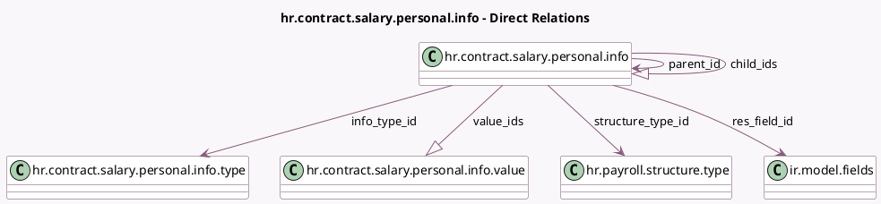

<!-- GENERATED:MODEL -->
---
tags: [odoo, enterprise, generated, model]
---

# hr.contract.salary.personal.info

- Module: [[docs/Enterprise Addons/hr_contract_salary/hr_contract_salary|hr_contract_salary]]
- Scope: Enterprise Addons
- Defined in module: yes
- Source files: `models/hr_contract_salary_personal_info.py`
- Python classes: `HrContractSalaryPersonalInfo`
- Description: Salary Package Personal Info

## Field footprint

- Detected fields: 17
- Field types: `Boolean` x 2, `Char` x 5, `Integer` x 1, `Many2one` x 4, `One2many` x 2, `Selection` x 3
- Relation fields: 6

## Sample fields

- `applies_on`: `Selection`
- `child_ids`: `One2many` (comodel `hr.contract.salary.personal.info`)
- `display_type`: `Selection`
- `dropdown_selection`: `Selection`
- `field`: `Char` (related `res_field_id.name`)
- `helper`: `Char`
- `impacts_net_salary`: `Boolean`
- `info_type_id`: `Many2one` (comodel `hr.contract.salary.personal.info.type`)
- `is_required`: `Boolean`
- `name`: `Char`
- `parent_id`: `Many2one` (comodel `hr.contract.salary.personal.info`)
- `placeholder`: `Char`
- `res_field_id`: `Many2one` (comodel `ir.model.fields`)
- `res_model`: `Char` (compute `_compute_res_model`)
- `sequence`: `Integer`
- `structure_type_id`: `Many2one` (comodel `hr.payroll.structure.type`)
- `value_ids`: `One2many` (comodel `hr.contract.salary.personal.info.value`)

## Method hints

- Detected methods: 4
- Action methods: none
- Compute methods: `_compute_res_model`
- Onchange methods: `_onchange_applies_on`

## Direct relation diagram

## Navigation

- **Parent:** [[docs/Enterprise Addons/hr_contract_salary/Models]]

<!-- GENERATED:MODEL -->
