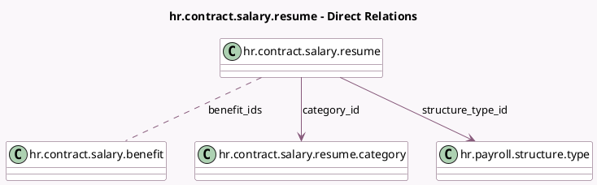

<!-- GENERATED:MODEL -->
---
tags: [odoo, enterprise, generated, model]
---

# hr.contract.salary.resume

- Module: [[docs/Enterprise Addons/hr_contract_salary/hr_contract_salary|hr_contract_salary]]
- Scope: Enterprise Addons
- Defined in module: yes
- Source files: `models/hr_contract_salary_resume.py`
- Python classes: `HrContractSalaryResume`
- Description: Salary Package Resume

## Field footprint

- Detected fields: 11
- Field types: `Boolean` x 2, `Char` x 1, `Float` x 1, `Integer` x 1, `Many2many` x 1, `Many2one` x 2, `Selection` x 3
- Relation fields: 3

## Sample fields

- `active`: `Boolean` (comodel `Active`)
- `benefit_ids`: `Many2many` (comodel `hr.contract.salary.benefit`)
- `category_id`: `Many2one` (comodel `hr.contract.salary.resume.category`)
- `code`: `Selection`
- `fixed_value`: `Float`
- `impacts_monthly_total`: `Boolean`
- `name`: `Char`
- `sequence`: `Integer`
- `structure_type_id`: `Many2one` (comodel `hr.payroll.structure.type`)
- `uom`: `Selection`
- `value_type`: `Selection`

## Method hints

- Detected methods: 1
- Action methods: none
- Compute methods: none
- Onchange methods: none

## Direct relation diagram

## Navigation

- **Parent:** [[docs/Enterprise Addons/hr_contract_salary/Models]]

<!-- GENERATED:MODEL -->
