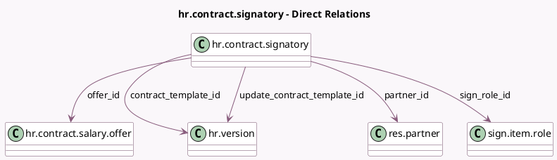

<!-- GENERATED:MODEL -->
---
tags: [odoo, enterprise, generated, model]
---

# hr.contract.signatory

- Module: [[docs/Enterprise Addons/hr_contract_salary/hr_contract_salary|hr_contract_salary]]
- Scope: Enterprise Addons
- Defined in module: yes
- Source files: `models/hr_contract_signatory.py`
- Python classes: `HrContractSignatory`
- Description: Contract Signatories

## Field footprint

- Detected fields: 7
- Field types: `Integer` x 1, `Many2one` x 5, `Selection` x 1
- Relation fields: 5

## Sample fields

- `contract_template_id`: `Many2one` (comodel `hr.version`)
- `offer_id`: `Many2one` (comodel `hr.contract.salary.offer`)
- `order`: `Integer` (comodel `Sign Order`)
- `partner_id`: `Many2one` (comodel `res.partner`)
- `sign_role_id`: `Many2one` (comodel `sign.item.role`)
- `signatory`: `Selection`
- `update_contract_template_id`: `Many2one` (comodel `hr.version`)

## Method hints

- Detected methods: 2
- Action methods: none
- Compute methods: none
- Onchange methods: none

## Direct relation diagram

## Navigation

- **Parent:** [[docs/Enterprise Addons/hr_contract_salary/Models]]

<!-- GENERATED:MODEL -->
