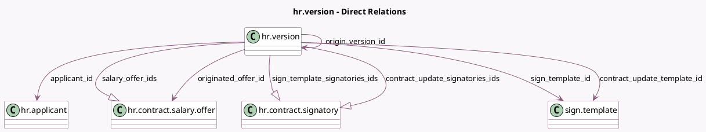

<!-- GENERATED:MODEL -->
---
tags: [odoo, enterprise, generated, model]
---

# hr.version

- Module: [[docs/Enterprise Addons/hr_contract_salary/hr_contract_salary|hr_contract_salary]]
- Scope: Enterprise Addons
- Defined in module: extension only
- Source files: `models/hr_version.py`
- Python classes: `HrVersion`

## Field footprint

- Detected fields: 22
- Field types: `Boolean` x 1, `Char` x 3, `Float` x 1, `Image` x 1, `Integer` x 3, `Many2one` x 6, `Monetary` x 4, `One2many` x 3
- Relation fields: 9

## Sample fields

- `applicant_id`: `Many2one` (comodel `hr.applicant`)
- `contract_reviews_count`: `Integer` (compute `_compute_contract_reviews_count`)
- `contract_template_id`: `Many2one`
- `contract_update_signatories_ids`: `One2many` (comodel `hr.contract.signatory`, compute `_compute_contract_update_signatories_ids`, store `True`)
- `contract_update_template_id`: `Many2one` (comodel `sign.template`, compute `_compute_contract_update_template_id`, store `True`)
- `final_yearly_costs`: `Monetary` (compute `_compute_final_yearly_costs`, store `True`)
- `hash_token`: `Char` (comodel `Created From Token`)
- `holidays`: `Float`
- `image_1920`: `Image` (related `employee_id.image_1920`)
- `image_1920_filename`: `Char`
- `is_origin_contract_template`: `Boolean` (compute `_compute_is_origin_contract_template`)
- `monthly_yearly_costs`: `Monetary` (compute `_compute_monthly_yearly_costs`)
- `origin_version_id`: `Many2one` (comodel `hr.version`)
- `originated_offer_id`: `Many2one` (comodel `hr.contract.salary.offer`)
- `salary_offer_ids`: `One2many` (comodel `hr.contract.salary.offer`)
- `salary_offers_count`: `Integer` (compute `_compute_salary_offers_count`)
- `sign_template_id`: `Many2one` (comodel `sign.template`, compute `_compute_sign_template_id`, store `True`)
- `sign_template_signatories_ids`: `One2many` (comodel `hr.contract.signatory`, compute `_compute_sign_template_signatories_ids`, store `True`)
- `signatures_count`: `Integer` (compute `_compute_signatures_count`)
- `template_warning`: `Char` (store `False`)

## Method hints

- Detected methods: 41
- Action methods: `action_archive`, `action_generate_offer`, `action_show_contract_reviews`
- Compute methods: `_compute_contract_reviews_count`, `_compute_contract_update_signatories_ids`, `_compute_contract_update_template_id`, `_compute_contract_wage`, `_compute_final_yearly_costs`, `_compute_is_origin_contract_template`, `_compute_monthly_yearly_costs`, `_compute_salary_offers_count`, and 5 more
- Onchange methods: `_onchange_final_yearly_costs`, `_onchange_wage_with_holidays`

## Direct relation diagram

## Navigation

- **Parent:** [[docs/Enterprise Addons/hr_contract_salary/Models]]

<!-- GENERATED:MODEL -->
