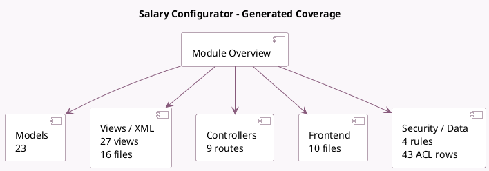

<!-- GENERATED:MODULE -->
---
tags: [odoo, enterprise, module]
---

# Salary Configurator

- Scope: Enterprise Addons
- Source: enterprise/hr_contract_salary
- Dependencies: [[docs/Enterprise Addons/hr_sign/hr_sign|hr_sign]], [[docs/Community Addons/http_routing/http_routing|http_routing]], [[docs/Community Addons/hr_recruitment/hr_recruitment|hr_recruitment]], [[docs/Enterprise Addons/sign/sign|sign]]

## Summary

Sign Employment Contracts

## Generated coverage

- Models: 23
- XML files with UI/data artifacts: 16
- Views: 27
- Actions: 12
- Menus: 10
- Rules (ir.rule): 4
- Access CSV entries: 43
- Controller units: 2
- Frontend asset files: 10

## Module map

## Detail notes

- Models: [[docs/Enterprise Addons/hr_contract_salary/Models|Models]] (23)
- Views and XML: [[docs/Enterprise Addons/hr_contract_salary/Views|Views]] (16 files)
- Controllers: [[docs/Enterprise Addons/hr_contract_salary/Controllers|Controllers]] (2)
- Frontend: [[docs/Enterprise Addons/hr_contract_salary/Frontend|Frontend]] (10 files)

## Key models

- `hr.applicant`
- `hr.contract.recruitment.report`
- `hr.contract.salary.benefit`
- `hr.contract.salary.benefit.type`
- `hr.contract.salary.benefit.value`
- `hr.contract.salary.offer`
- `hr.contract.salary.offer.refusal.reason`
- `hr.contract.salary.personal.info`
- `hr.contract.salary.personal.info.type`
- `hr.contract.salary.personal.info.value`
- `hr.contract.salary.resume`
- `hr.contract.salary.resume.category`

## Navigation

- [[../Enterprise Addons/Enterprise Addons|Back to scope]]
- [[../../docs/docs|Back to docs]]

<!-- GENERATED:MODULE -->

