<!-- GENERATED:MODEL -->
---
tags: [odoo, enterprise, generated, model]
---

# hr.contract.salary.benefit

- Module: [[docs/Enterprise Addons/hr_contract_salary_payroll/hr_contract_salary_payroll|hr_contract_salary_payroll]]
- Scope: Enterprise Addons
- Defined in module: extension only
- Source files: `models/hr_contract_salary_benefit.py`
- Python classes: `HrContractSalaryBenefit`

## Field footprint

- Detected fields: 2
- Field types: `Many2one` x 1, `Selection` x 1
- Relation fields: 1

## Sample fields

- `salary_rule_id`: `Many2one` (comodel `hr.salary.rule`)
- `source`: `Selection`

## Method hints

- Detected methods: 1
- Action methods: none
- Compute methods: `_compute_field`
- Onchange methods: none

## Direct relation diagram

```plantuml
@startuml
!define ODOO_COLOR_PRIMARY #714B67
!define ODOO_COLOR_ACCENT #875A7B
!define ODOO_COLOR_BG #FAF7FA

skinparam backgroundColor ODOO_COLOR_BG
skinparam defaultTextAlignment left
skinparam ArrowColor ODOO_COLOR_ACCENT
skinparam ClassBackgroundColor white
skinparam ClassBorderColor ODOO_COLOR_PRIMARY
skinparam ComponentBackgroundColor white
skinparam ComponentBorderColor ODOO_COLOR_PRIMARY
skinparam NoteBackgroundColor #FFF8FF
skinparam NoteBorderColor ODOO_COLOR_ACCENT
skinparam SequenceLifeLineBorderColor ODOO_COLOR_ACCENT
skinparam SequenceLifeLineBackgroundColor #FFFFFF
skinparam SequenceParticipantBorderColor ODOO_COLOR_PRIMARY
skinparam SequenceParticipantBackgroundColor #FFFFFF
skinparam sequence {
  ArrowColor ODOO_COLOR_ACCENT
  ActorBorderColor ODOO_COLOR_PRIMARY
}
title hr.contract.salary.benefit - Direct Relations
class "hr.contract.salary.benefit" as hr_contract_salary_benefit
class "hr.salary.rule" as hr_salary_rule
hr_contract_salary_benefit --> hr_salary_rule : salary_rule_id
@enduml
```

## Navigation

- **Parent:** [[docs/Enterprise Addons/hr_contract_salary_payroll/Models]]

<!-- GENERATED:MODEL -->
