<!-- GENERATED:MODEL -->
---
tags: [odoo, enterprise, generated, model]
---

# hr.contract.salary.offer

- Module: [[docs/Enterprise Addons/hr_contract_salary_payroll/hr_contract_salary_payroll|hr_contract_salary_payroll]]
- Scope: Enterprise Addons
- Defined in module: extension only
- Source files: `models/hr_contract_salary_offer.py`
- Python classes: `HrContractSalaryOffer`

## Field footprint

- Detected fields: 15
- Field types: `Boolean` x 2, `Many2one` x 4, `Monetary` x 8, `Selection` x 1
- Relation fields: 4

## Sample fields

- `budget_type`: `Selection`
- `country_id`: `Many2one` (related `company_id.country_id`)
- `final_yearly_costs`: `Monetary` (compute `_compute_final_yearly_costs`, store `True`)
- `gross_wage`: `Monetary` (compute `_compute_salary`, store `True`)
- `is_full_time`: `Boolean` (compute `_compute_salary`, store `True`)
- `is_simulation_offer`: `Boolean`
- `monthly_benefits`: `Monetary` (compute `_compute_salary`, store `True`)
- `monthly_employer_cost`: `Monetary` (compute `_compute_salary`, store `True`)
- `monthly_wage`: `Monetary` (compute `_compute_monthly_wage`, store `True`)
- `net_wage`: `Monetary` (compute `_compute_salary`, store `True`)
- `resource_calendar_id`: `Many2one` (comodel `resource.calendar`)
- `simulation_employee_id`: `Many2one` (comodel `hr.employee`)
- `structure_id`: `Many2one` (comodel `hr.payroll.structure`)
- `yearly_benefits`: `Monetary` (compute `_compute_salary`, store `True`)
- `yearly_employer_cost`: `Monetary` (compute `_compute_salary`, store `True`)

## Method hints

- Detected methods: 11
- Action methods: `action_cron_remove_simulation_offers`, `action_open_salary_configurator`
- Compute methods: `_compute_final_yearly_costs`, `_compute_monthly_wage`, `_compute_salary`
- Onchange methods: `_onchange_simulation_employee_id`

## Direct relation diagram

```plantuml
@startuml
!define ODOO_COLOR_PRIMARY #714B67
!define ODOO_COLOR_ACCENT #875A7B
!define ODOO_COLOR_BG #FAF7FA

skinparam backgroundColor ODOO_COLOR_BG
skinparam defaultTextAlignment left
skinparam ArrowColor ODOO_COLOR_ACCENT
skinparam ClassBackgroundColor white
skinparam ClassBorderColor ODOO_COLOR_PRIMARY
skinparam ComponentBackgroundColor white
skinparam ComponentBorderColor ODOO_COLOR_PRIMARY
skinparam NoteBackgroundColor #FFF8FF
skinparam NoteBorderColor ODOO_COLOR_ACCENT
skinparam SequenceLifeLineBorderColor ODOO_COLOR_ACCENT
skinparam SequenceLifeLineBackgroundColor #FFFFFF
skinparam SequenceParticipantBorderColor ODOO_COLOR_PRIMARY
skinparam SequenceParticipantBackgroundColor #FFFFFF
skinparam sequence {
  ArrowColor ODOO_COLOR_ACCENT
  ActorBorderColor ODOO_COLOR_PRIMARY
}
title hr.contract.salary.offer - Direct Relations
class "hr.contract.salary.offer" as hr_contract_salary_offer
class "hr.employee" as hr_employee
class "hr.payroll.structure" as hr_payroll_structure
class "resource.calendar" as resource_calendar
hr_contract_salary_offer --> hr_payroll_structure : structure_id
hr_contract_salary_offer --> resource_calendar : resource_calendar_id
hr_contract_salary_offer --> hr_employee : simulation_employee_id
@enduml
```

## Navigation

- **Parent:** [[docs/Enterprise Addons/hr_contract_salary_payroll/Models]]

<!-- GENERATED:MODEL -->
