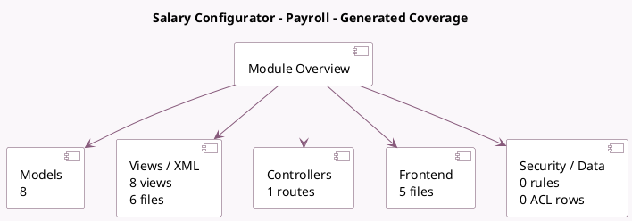

<!-- GENERATED:MODULE -->
---
tags: [odoo, enterprise, module]
---

# Salary Configurator - Payroll

- Scope: Enterprise Addons
- Source: enterprise/hr_contract_salary_payroll
- Dependencies: [[docs/Enterprise Addons/hr_contract_salary/hr_contract_salary|hr_contract_salary]], [[docs/Enterprise Addons/hr_payroll/hr_payroll|hr_payroll]]

## Summary

Adds a Gross to Net Salary Simulaton

## Generated coverage

- Models: 8
- XML files with UI/data artifacts: 6
- Views: 8
- Actions: 2
- Menus: 6
- Rules (ir.rule): 0
- Access CSV entries: 0
- Controller units: 1
- Frontend asset files: 5

## Module map

## Detail notes

- Models: [[docs/Enterprise Addons/hr_contract_salary_payroll/Models|Models]] (8)
- Views and XML: [[docs/Enterprise Addons/hr_contract_salary_payroll/Views|Views]] (6 files)
- Controllers: [[docs/Enterprise Addons/hr_contract_salary_payroll/Controllers|Controllers]] (1)
- Frontend: [[docs/Enterprise Addons/hr_contract_salary_payroll/Frontend|Frontend]] (5 files)

## Key models

- `hr.applicant`
- `hr.contract.salary.benefit`
- `hr.contract.salary.offer`
- `hr.contract.salary.resume`
- `hr.employee`
- `hr.payroll.headcount.line`
- `hr.payslip.worked_days`
- `hr.version`

## Navigation

- [[../Enterprise Addons/Enterprise Addons|Back to scope]]
- [[../../docs/docs|Back to docs]]

<!-- GENERATED:MODULE -->

