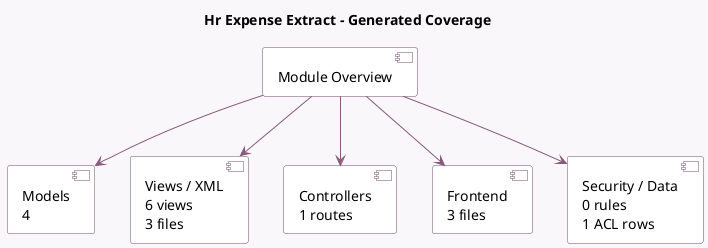

<!-- GENERATED:MODULE -->
---
tags: [odoo, enterprise, module]
---

# Hr Expense Extract

- Scope: Enterprise Addons
- Source: enterprise/hr_expense_extract
- Dependencies: [[docs/Community Addons/hr_expense/hr_expense|hr_expense]], [[docs/Enterprise Addons/iap_extract/iap_extract|iap_extract]], [[docs/Community Addons/iap_mail/iap_mail|iap_mail]], [[docs/Enterprise Addons/mail_enterprise/mail_enterprise|mail_enterprise]], [[docs/Enterprise Addons/hr_expense_predict_product/hr_expense_predict_product|hr_expense_predict_product]]

## Summary

Extract data from expense scans to fill them automatically

## Generated coverage

- Models: 4
- XML files with UI/data artifacts: 3
- Views: 6
- Actions: 2
- Menus: 0
- Rules (ir.rule): 0
- Access CSV entries: 1
- Controller units: 1
- Frontend asset files: 3

## Module map

## Detail notes

- Models: [[docs/Enterprise Addons/hr_expense_extract/Models|Models]] (4)
- Views and XML: [[docs/Enterprise Addons/hr_expense_extract/Views|Views]] (3 files)
- Controllers: [[docs/Enterprise Addons/hr_expense_extract/Controllers|Controllers]] (1)
- Frontend: [[docs/Enterprise Addons/hr_expense_extract/Frontend|Frontend]] (3 files)

## Key models

- `expense.sample.receipt`
- `hr.expense`
- `res.company`
- `res.config.settings`

## Navigation

- [[../Enterprise Addons/Enterprise Addons|Back to scope]]
- [[../../docs/docs|Back to docs]]

<!-- GENERATED:MODULE -->

