<!-- GENERATED:MODEL -->
---
tags: [odoo, enterprise, generated, model]
---

# account.journal

- Module: [[docs/Enterprise Addons/hr_expense_stripe/hr_expense_stripe|hr_expense_stripe]]
- Scope: Enterprise Addons
- Defined in module: extension only
- Source files: `models/account_journal.py`
- Python classes: `AccountJournal`

## Field footprint

- Detected fields: 5
- Field types: `Integer` x 2, `Many2one` x 1, `Monetary` x 1, `One2many` x 1
- Relation fields: 2

## Sample fields

- `nb_stripe_card`: `Integer` (compute `_compute_nb_stripe_card`)
- `stripe_card_ids`: `One2many` (comodel `hr.expense.stripe.card`)
- `stripe_currency_id`: `Many2one` (related `company_id.stripe_currency_id`)
- `stripe_issuing_balance`: `Monetary`
- `stripe_issuing_balance_timestamp`: `Integer`

## Method hints

- Detected methods: 6
- Action methods: `action_open_stripe_issuing_cards`, `action_open_topup_wizard`
- Compute methods: `_compute_nb_stripe_card`
- Onchange methods: none

## Direct relation diagram

```plantuml
@startuml
!define ODOO_COLOR_PRIMARY #714B67
!define ODOO_COLOR_ACCENT #875A7B
!define ODOO_COLOR_BG #FAF7FA

skinparam backgroundColor ODOO_COLOR_BG
skinparam defaultTextAlignment left
skinparam ArrowColor ODOO_COLOR_ACCENT
skinparam ClassBackgroundColor white
skinparam ClassBorderColor ODOO_COLOR_PRIMARY
skinparam ComponentBackgroundColor white
skinparam ComponentBorderColor ODOO_COLOR_PRIMARY
skinparam NoteBackgroundColor #FFF8FF
skinparam NoteBorderColor ODOO_COLOR_ACCENT
skinparam SequenceLifeLineBorderColor ODOO_COLOR_ACCENT
skinparam SequenceLifeLineBackgroundColor #FFFFFF
skinparam SequenceParticipantBorderColor ODOO_COLOR_PRIMARY
skinparam SequenceParticipantBackgroundColor #FFFFFF
skinparam sequence {
  ArrowColor ODOO_COLOR_ACCENT
  ActorBorderColor ODOO_COLOR_PRIMARY
}
title account.journal - Direct Relations
class "account.journal" as account_journal
class "hr.expense.stripe.card" as hr_expense_stripe_card
account_journal --|> hr_expense_stripe_card : stripe_card_ids
@enduml
```

## Navigation

- **Parent:** [[docs/Enterprise Addons/hr_expense_stripe/Models]]

<!-- GENERATED:MODEL -->
