<!-- GENERATED:MODEL -->
---
tags: [odoo, enterprise, generated, model]
---

# hr.expense

- Module: [[docs/Enterprise Addons/hr_expense_stripe/hr_expense_stripe|hr_expense_stripe]]
- Scope: Enterprise Addons
- Defined in module: extension only
- Source files: `models/hr_expense.py`
- Python classes: `HrExpense`

## Field footprint

- Detected fields: 5
- Field types: `Boolean` x 1, `Char` x 2, `Many2one` x 2
- Relation fields: 2

## Sample fields

- `card_id`: `Many2one` (comodel `hr.expense.stripe.card`)
- `is_card_expense`: `Boolean` (compute `_compute_is_card_expense`)
- `mcc_tag_id`: `Many2one` (comodel `product.mcc.stripe.tag`)
- `stripe_authorization_id`: `Char` (comodel `Stripe Authorization ID`)
- `stripe_transaction_id`: `Char` (comodel `Stripe Transaction ID`)

## Method hints

- Detected methods: 17
- Action methods: `action_open_stripe_card`, `action_split_wizard`, `action_submit`
- Compute methods: `_compute_is_card_expense`
- Onchange methods: none

## Direct relation diagram

```plantuml
@startuml
!define ODOO_COLOR_PRIMARY #714B67
!define ODOO_COLOR_ACCENT #875A7B
!define ODOO_COLOR_BG #FAF7FA

skinparam backgroundColor ODOO_COLOR_BG
skinparam defaultTextAlignment left
skinparam ArrowColor ODOO_COLOR_ACCENT
skinparam ClassBackgroundColor white
skinparam ClassBorderColor ODOO_COLOR_PRIMARY
skinparam ComponentBackgroundColor white
skinparam ComponentBorderColor ODOO_COLOR_PRIMARY
skinparam NoteBackgroundColor #FFF8FF
skinparam NoteBorderColor ODOO_COLOR_ACCENT
skinparam SequenceLifeLineBorderColor ODOO_COLOR_ACCENT
skinparam SequenceLifeLineBackgroundColor #FFFFFF
skinparam SequenceParticipantBorderColor ODOO_COLOR_PRIMARY
skinparam SequenceParticipantBackgroundColor #FFFFFF
skinparam sequence {
  ArrowColor ODOO_COLOR_ACCENT
  ActorBorderColor ODOO_COLOR_PRIMARY
}
title hr.expense - Direct Relations
class "hr.expense" as hr_expense
class "hr.expense.stripe.card" as hr_expense_stripe_card
class "product.mcc.stripe.tag" as product_mcc_stripe_tag
hr_expense --> hr_expense_stripe_card : card_id
hr_expense --> product_mcc_stripe_tag : mcc_tag_id
@enduml
```

## Navigation

- **Parent:** [[docs/Enterprise Addons/hr_expense_stripe/Models]]

<!-- GENERATED:MODEL -->
