<!-- GENERATED:MODEL -->
---
tags: [odoo, enterprise, generated, model]
---

# hr.expense.stripe.card.block.wizard

- Module: [[docs/Enterprise Addons/hr_expense_stripe/hr_expense_stripe|hr_expense_stripe]]
- Scope: Enterprise Addons
- Defined in module: yes
- Source files: `wizard/hr_expense_stripe_card_block_wizard.py`
- Python classes: `HrExpenseStripeCardBlockWizard`
- Description: A wizard used to block a card

## Field footprint

- Detected fields: 3
- Field types: `Char` x 1, `Many2one` x 1, `Selection` x 1
- Relation fields: 1

## Sample fields

- `cancellation_reason`: `Selection`
- `card_id`: `Many2one` (comodel `hr.expense.stripe.card`)
- `other_reason_text`: `Char`

## Method hints

- Detected methods: 1
- Action methods: `action_block_card`
- Compute methods: none
- Onchange methods: none

## Direct relation diagram

```plantuml
@startuml
!define ODOO_COLOR_PRIMARY #714B67
!define ODOO_COLOR_ACCENT #875A7B
!define ODOO_COLOR_BG #FAF7FA

skinparam backgroundColor ODOO_COLOR_BG
skinparam defaultTextAlignment left
skinparam ArrowColor ODOO_COLOR_ACCENT
skinparam ClassBackgroundColor white
skinparam ClassBorderColor ODOO_COLOR_PRIMARY
skinparam ComponentBackgroundColor white
skinparam ComponentBorderColor ODOO_COLOR_PRIMARY
skinparam NoteBackgroundColor #FFF8FF
skinparam NoteBorderColor ODOO_COLOR_ACCENT
skinparam SequenceLifeLineBorderColor ODOO_COLOR_ACCENT
skinparam SequenceLifeLineBackgroundColor #FFFFFF
skinparam SequenceParticipantBorderColor ODOO_COLOR_PRIMARY
skinparam SequenceParticipantBackgroundColor #FFFFFF
skinparam sequence {
  ArrowColor ODOO_COLOR_ACCENT
  ActorBorderColor ODOO_COLOR_PRIMARY
}
title hr.expense.stripe.card.block.wizard - Direct Relations
class "hr.expense.stripe.card.block.wizard" as hr_expense_stripe_card_block_wizard
class "hr.expense.stripe.card" as hr_expense_stripe_card
hr_expense_stripe_card_block_wizard --> hr_expense_stripe_card : card_id
@enduml
```

## Navigation

- **Parent:** [[docs/Enterprise Addons/hr_expense_stripe/Models]]

<!-- GENERATED:MODEL -->
