<!-- GENERATED:MODEL -->
---
tags: [odoo, enterprise, generated, model]
---

# hr.expense.stripe.card

- Module: [[docs/Enterprise Addons/hr_expense_stripe/hr_expense_stripe|hr_expense_stripe]]
- Scope: Enterprise Addons
- Defined in module: yes
- Source files: `models/hr_expense_stripe_card.py`
- Python classes: `HrExpenseStripeCard`
- Description: Employee Expense Card
- Inherits: `mail.thread`

## Field footprint

- Detected fields: 33
- Field types: `Boolean` x 3, `Char` x 9, `Datetime` x 1, `Integer` x 1, `Many2many` x 2, `Many2one` x 9, `Monetary` x 2, `One2many` x 1, `Selection` x 5
- Relation fields: 12

## Sample fields

- `cancellation_reason`: `Selection`
- `card_name`: `Char`
- `card_number_public`: `Char` (compute `_compute_card_number`)
- `card_type`: `Selection`
- `company_id`: `Many2one` (comodel `res.company`)
- `company_partner_id`: `Many2one` (comodel `res.partner`, related `company_id.partner_id`)
- `currency_id`: `Many2one` (related `company_id.stripe_currency_id`)
- `delivery_address_id`: `Many2one` (comodel `res.partner`)
- `employee_id`: `Many2one` (comodel `hr.employee`)
- `employee_name`: `Char` (compute `_compute_from_employee`)
- `expense_ids`: `One2many` (comodel `hr.expense`)
- `expenses_count`: `Integer` (compute `_compute_expenses_count`)
- `expiration`: `Char`
- `has_employee`: `Boolean` (compute `_compute_from_employee`)
- `has_limit_higher_than_stripe_warning`: `Boolean` (compute `_compute_has_limit_higher_than_stripe_warning`)
- `is_delivered`: `Boolean`
- `journal_id`: `Many2one` (comodel `account.journal`)
- `last_4`: `Char`
- `name`: `Char` (compute `_compute_name`, store `True`)
- `ordered_by`: `Many2one` (comodel `res.users`)

## Method hints

- Detected methods: 28
- Action methods: `action_activate_card`, `action_block_card`, `action_open_card_private_view`, `action_open_cardholder_wizard`, `action_open_employee`, `action_open_expenses`, `action_pause_card`, `action_pause_card_warning_view`, and 2 more
- Compute methods: `_compute_card_number`, `_compute_expenses_count`, `_compute_from_employee`, `_compute_has_limit_higher_than_stripe_warning`, `_compute_name`
- Onchange methods: none

## Direct relation diagram

```plantuml
@startuml
!define ODOO_COLOR_PRIMARY #714B67
!define ODOO_COLOR_ACCENT #875A7B
!define ODOO_COLOR_BG #FAF7FA

skinparam backgroundColor ODOO_COLOR_BG
skinparam defaultTextAlignment left
skinparam ArrowColor ODOO_COLOR_ACCENT
skinparam ClassBackgroundColor white
skinparam ClassBorderColor ODOO_COLOR_PRIMARY
skinparam ComponentBackgroundColor white
skinparam ComponentBorderColor ODOO_COLOR_PRIMARY
skinparam NoteBackgroundColor #FFF8FF
skinparam NoteBorderColor ODOO_COLOR_ACCENT
skinparam SequenceLifeLineBorderColor ODOO_COLOR_ACCENT
skinparam SequenceLifeLineBackgroundColor #FFFFFF
skinparam SequenceParticipantBorderColor ODOO_COLOR_PRIMARY
skinparam SequenceParticipantBackgroundColor #FFFFFF
skinparam sequence {
  ArrowColor ODOO_COLOR_ACCENT
  ActorBorderColor ODOO_COLOR_PRIMARY
}
title hr.expense.stripe.card - Direct Relations
class "hr.expense.stripe.card" as hr_expense_stripe_card
class "account.journal" as account_journal
class "account.payment.method.line" as account_payment_method_line
class "hr.employee" as hr_employee
class "hr.expense" as hr_expense
class "product.mcc.stripe.tag" as product_mcc_stripe_tag
class "res.company" as res_company
class "res.country" as res_country
class "res.partner" as res_partner
class "res.users" as res_users
hr_expense_stripe_card --> res_company : company_id
hr_expense_stripe_card --> res_partner : company_partner_id
hr_expense_stripe_card --> hr_employee : employee_id
hr_expense_stripe_card --> account_journal : journal_id
hr_expense_stripe_card --> res_partner : delivery_address_id
hr_expense_stripe_card --> res_users : ordered_by
hr_expense_stripe_card .. product_mcc_stripe_tag : spending_policy_category_tag_ids
hr_expense_stripe_card .. res_country : spending_policy_country_tag_ids
hr_expense_stripe_card --|> hr_expense : expense_ids
hr_expense_stripe_card --> account_payment_method_line : payment_method_line_id
@enduml
```

## Navigation

- **Parent:** [[docs/Enterprise Addons/hr_expense_stripe/Models]]

<!-- GENERATED:MODEL -->
