<!-- GENERATED:MODEL -->
---
tags: [odoo, enterprise, generated, model]
---

# hr.expense.stripe.card.receive.wizard

- Module: [[docs/Enterprise Addons/hr_expense_stripe/hr_expense_stripe|hr_expense_stripe]]
- Scope: Enterprise Addons
- Defined in module: yes
- Source files: `wizard/hr_expense_stripe_card_receive_wizard.py`
- Python classes: `HrExpenseStripeCardReceiveWizard`
- Description: A wizard used to first active a card when received

## Field footprint

- Detected fields: 8
- Field types: `Boolean` x 2, `Char` x 5, `Many2one` x 1
- Relation fields: 1

## Sample fields

- `billing_country_code`: `Char`
- `card_id`: `Many2one` (comodel `hr.expense.stripe.card`)
- `card_last_4`: `Char` (related `card_id.last_4`)
- `is_confirmed`: `Boolean`
- `last_4_challenge`: `Char`
- `original_phone_number`: `Char`
- `phone_number`: `Char`
- `show_warning_wrong_last_4`: `Boolean` (compute `_compute_show_warning_wrong_last_4`)

## Method hints

- Detected methods: 4
- Action methods: `action_receive_card`
- Compute methods: `_compute_show_warning_wrong_last_4`
- Onchange methods: none

## Direct relation diagram

```plantuml
@startuml
!define ODOO_COLOR_PRIMARY #714B67
!define ODOO_COLOR_ACCENT #875A7B
!define ODOO_COLOR_BG #FAF7FA

skinparam backgroundColor ODOO_COLOR_BG
skinparam defaultTextAlignment left
skinparam ArrowColor ODOO_COLOR_ACCENT
skinparam ClassBackgroundColor white
skinparam ClassBorderColor ODOO_COLOR_PRIMARY
skinparam ComponentBackgroundColor white
skinparam ComponentBorderColor ODOO_COLOR_PRIMARY
skinparam NoteBackgroundColor #FFF8FF
skinparam NoteBorderColor ODOO_COLOR_ACCENT
skinparam SequenceLifeLineBorderColor ODOO_COLOR_ACCENT
skinparam SequenceLifeLineBackgroundColor #FFFFFF
skinparam SequenceParticipantBorderColor ODOO_COLOR_PRIMARY
skinparam SequenceParticipantBackgroundColor #FFFFFF
skinparam sequence {
  ArrowColor ODOO_COLOR_ACCENT
  ActorBorderColor ODOO_COLOR_PRIMARY
}
title hr.expense.stripe.card.receive.wizard - Direct Relations
class "hr.expense.stripe.card.receive.wizard" as hr_expense_stripe_card_receive_wizard
class "hr.expense.stripe.card" as hr_expense_stripe_card
hr_expense_stripe_card_receive_wizard --> hr_expense_stripe_card : card_id
@enduml
```

## Navigation

- **Parent:** [[docs/Enterprise Addons/hr_expense_stripe/Models]]

<!-- GENERATED:MODEL -->
