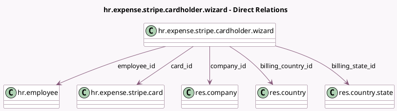

<!-- GENERATED:MODEL -->
---
tags: [odoo, enterprise, generated, model]
---

# hr.expense.stripe.cardholder.wizard

- Module: [[docs/Enterprise Addons/hr_expense_stripe/hr_expense_stripe|hr_expense_stripe]]
- Scope: Enterprise Addons
- Defined in module: yes
- Source files: `wizard/hr_expense_stripe_cardholder_wizard.py`
- Python classes: `HrExpenseStripeCardholderWizard`
- Description: Wizard to configure the cardholder
- Inherits: `mail.thread`

## Field footprint

- Detected fields: 16
- Field types: `Char` x 8, `Date` x 1, `Json` x 1, `Many2one` x 6
- Relation fields: 6

## Sample fields

- `billing_city`: `Char`
- `billing_country_id`: `Many2one` (comodel `res.country`)
- `billing_state_id`: `Many2one` (comodel `res.country.state`)
- `billing_street`: `Char`
- `billing_street2`: `Char`
- `billing_zip`: `Char`
- `birthday`: `Date`
- `card_id`: `Many2one` (comodel `hr.expense.stripe.card`)
- `company_country_id`: `Many2one` (related `company_id.country_id`)
- `company_id`: `Many2one` (comodel `res.company`)
- `email`: `Char`
- `employee_id`: `Many2one` (comodel `hr.employee`)
- `firstname`: `Char`
- `lastname`: `Char`
- `phone_number`: `Char`
- `stripe_values`: `Json`

## Method hints

- Detected methods: 5
- Action methods: `action_save_cardholder`
- Compute methods: none
- Onchange methods: none

## Direct relation diagram

## Navigation

- **Parent:** [[docs/Enterprise Addons/hr_expense_stripe/Models]]

<!-- GENERATED:MODEL -->
