<!-- GENERATED:MODEL -->
---
tags: [odoo, enterprise, generated, model]
---

# hr.expense.stripe.topup.wizard

- Module: [[docs/Enterprise Addons/hr_expense_stripe/hr_expense_stripe|hr_expense_stripe]]
- Scope: Enterprise Addons
- Defined in module: yes
- Source files: `wizard/hr_expense_stripe_topup_wizard.py`
- Python classes: `HrExpenseStripeTopupWizard`
- Description: Stripe Issuing Top-up Wizard

## Field footprint

- Detected fields: 10
- Field types: `Boolean` x 1, `Char` x 3, `Html` x 1, `Many2one` x 3, `Monetary` x 1, `Selection` x 1
- Relation fields: 3

## Sample fields

- `account_number`: `Char` (related `partner_bank_id.acc_number`)
- `amount`: `Monetary`
- `bic`: `Char` (related `partner_bank_id.bank_bic`)
- `company_id`: `Many2one` (comodel `res.company`)
- `currency_id`: `Many2one` (comodel `res.currency`)
- `is_live_mode`: `Boolean`
- `partner_bank_id`: `Many2one` (comodel `res.partner.bank`)
- `pull_push_funds`: `Selection` (compute `_compute_pull_push_funds`)
- `qr_code`: `Html` (compute `_compute_qr_code`)
- `statement_description`: `Char`

## Method hints

- Detected methods: 5
- Action methods: `action_topup`
- Compute methods: `_compute_pull_push_funds`, `_compute_qr_code`
- Onchange methods: none

## Direct relation diagram

```plantuml
@startuml
!define ODOO_COLOR_PRIMARY #714B67
!define ODOO_COLOR_ACCENT #875A7B
!define ODOO_COLOR_BG #FAF7FA

skinparam backgroundColor ODOO_COLOR_BG
skinparam defaultTextAlignment left
skinparam ArrowColor ODOO_COLOR_ACCENT
skinparam ClassBackgroundColor white
skinparam ClassBorderColor ODOO_COLOR_PRIMARY
skinparam ComponentBackgroundColor white
skinparam ComponentBorderColor ODOO_COLOR_PRIMARY
skinparam NoteBackgroundColor #FFF8FF
skinparam NoteBorderColor ODOO_COLOR_ACCENT
skinparam SequenceLifeLineBorderColor ODOO_COLOR_ACCENT
skinparam SequenceLifeLineBackgroundColor #FFFFFF
skinparam SequenceParticipantBorderColor ODOO_COLOR_PRIMARY
skinparam SequenceParticipantBackgroundColor #FFFFFF
skinparam sequence {
  ArrowColor ODOO_COLOR_ACCENT
  ActorBorderColor ODOO_COLOR_PRIMARY
}
title hr.expense.stripe.topup.wizard - Direct Relations
class "hr.expense.stripe.topup.wizard" as hr_expense_stripe_topup_wizard
class "res.company" as res_company
class "res.currency" as res_currency
class "res.partner.bank" as res_partner_bank
hr_expense_stripe_topup_wizard --> res_company : company_id
hr_expense_stripe_topup_wizard --> res_currency : currency_id
hr_expense_stripe_topup_wizard --> res_partner_bank : partner_bank_id
@enduml
```

## Navigation

- **Parent:** [[docs/Enterprise Addons/hr_expense_stripe/Models]]

<!-- GENERATED:MODEL -->
