<!-- GENERATED:MODEL -->
---
tags: [odoo, enterprise, generated, model]
---

# product.product

- Module: [[docs/Enterprise Addons/hr_expense_stripe/hr_expense_stripe|hr_expense_stripe]]
- Scope: Enterprise Addons
- Defined in module: extension only
- Source files: `models/product_product.py`
- Python classes: `ProductProduct`

## Field footprint

- Detected fields: 2
- Field types: `Boolean` x 1, `One2many` x 1
- Relation fields: 1

## Sample fields

- `stripe_issuing_activated`: `Boolean` (compute `_compute_stripe_issuing_activated`)
- `stripe_mcc_ids`: `One2many` (comodel `product.mcc.stripe.tag`)

## Method hints

- Detected methods: 2
- Action methods: none
- Compute methods: `_compute_stripe_issuing_activated`
- Onchange methods: none

## Direct relation diagram

```plantuml
@startuml
!define ODOO_COLOR_PRIMARY #714B67
!define ODOO_COLOR_ACCENT #875A7B
!define ODOO_COLOR_BG #FAF7FA

skinparam backgroundColor ODOO_COLOR_BG
skinparam defaultTextAlignment left
skinparam ArrowColor ODOO_COLOR_ACCENT
skinparam ClassBackgroundColor white
skinparam ClassBorderColor ODOO_COLOR_PRIMARY
skinparam ComponentBackgroundColor white
skinparam ComponentBorderColor ODOO_COLOR_PRIMARY
skinparam NoteBackgroundColor #FFF8FF
skinparam NoteBorderColor ODOO_COLOR_ACCENT
skinparam SequenceLifeLineBorderColor ODOO_COLOR_ACCENT
skinparam SequenceLifeLineBackgroundColor #FFFFFF
skinparam SequenceParticipantBorderColor ODOO_COLOR_PRIMARY
skinparam SequenceParticipantBackgroundColor #FFFFFF
skinparam sequence {
  ArrowColor ODOO_COLOR_ACCENT
  ActorBorderColor ODOO_COLOR_PRIMARY
}
title product.product - Direct Relations
class "product.product" as product_product
class "product.mcc.stripe.tag" as product_mcc_stripe_tag
product_product --|> product_mcc_stripe_tag : stripe_mcc_ids
@enduml
```

## Navigation

- **Parent:** [[docs/Enterprise Addons/hr_expense_stripe/Models]]

<!-- GENERATED:MODEL -->
