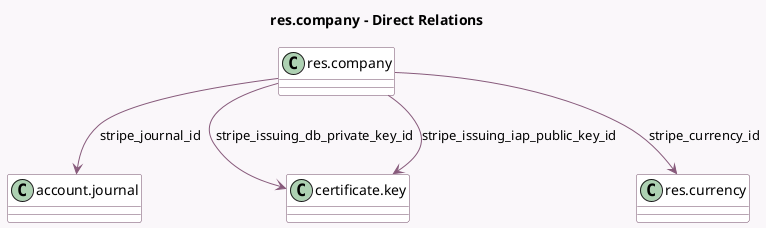

<!-- GENERATED:MODEL -->
---
tags: [odoo, enterprise, generated, model]
---

# res.company

- Module: [[docs/Enterprise Addons/hr_expense_stripe/hr_expense_stripe|hr_expense_stripe]]
- Scope: Enterprise Addons
- Defined in module: extension only
- Source files: `models/res_company.py`
- Python classes: `ResCompany`

## Field footprint

- Detected fields: 10
- Field types: `Boolean` x 2, `Char` x 2, `Date` x 1, `Many2one` x 4, `Selection` x 1
- Relation fields: 4

## Sample fields

- `stripe_account_issuing_status`: `Selection`
- `stripe_account_issuing_tos_acceptance_date`: `Date`
- `stripe_account_issuing_tos_accepted`: `Boolean`
- `stripe_currency_id`: `Many2one` (comodel `res.currency`, compute `_compute_stripe_currency`, store `True`)
- `stripe_id`: `Char`
- `stripe_issuing_activated`: `Boolean`
- `stripe_issuing_db_private_key_id`: `Many2one` (comodel `certificate.key`)
- `stripe_issuing_iap_public_key_id`: `Many2one` (comodel `certificate.key`)
- `stripe_issuing_iap_webhook_uuid`: `Char`
- `stripe_journal_id`: `Many2one` (comodel `account.journal`)

## Method hints

- Detected methods: 10
- Action methods: `action_configure_stripe_account`, `action_create_stripe_account`, `action_refresh_stripe_account`
- Compute methods: `_compute_stripe_currency`
- Onchange methods: none

## Direct relation diagram

## Navigation

- **Parent:** [[docs/Enterprise Addons/hr_expense_stripe/Models]]

<!-- GENERATED:MODEL -->
