<!-- GENERATED:MODEL -->
---
tags: [odoo, enterprise, generated, model]
---

# res.config.settings

- Module: [[docs/Enterprise Addons/hr_expense_stripe/hr_expense_stripe|hr_expense_stripe]]
- Scope: Enterprise Addons
- Defined in module: extension only
- Source files: `models/res_config_settings.py`
- Python classes: `ResConfigSettings`

## Field footprint

- Detected fields: 5
- Field types: `Boolean` x 1, `Char` x 1, `Many2one` x 2, `Selection` x 1
- Relation fields: 2

## Sample fields

- `stripe_account_issuing_status`: `Selection` (related `company_id.stripe_account_issuing_status`)
- `stripe_account_issuing_tos_accepted`: `Boolean` (related `company_id.stripe_account_issuing_tos_accepted`)
- `stripe_company_currency_id`: `Many2one` (related `company_id.stripe_currency_id`)
- `stripe_id`: `Char` (related `company_id.stripe_id`)
- `stripe_journal_id`: `Many2one` (comodel `account.journal`, related `company_id.stripe_journal_id`)

## Method hints

- Detected methods: 4
- Action methods: `action_configure_stripe_account`, `action_create_stripe_account`, `action_refresh_stripe_account`
- Compute methods: none
- Onchange methods: none

## Direct relation diagram

```plantuml
@startuml
!define ODOO_COLOR_PRIMARY #714B67
!define ODOO_COLOR_ACCENT #875A7B
!define ODOO_COLOR_BG #FAF7FA

skinparam backgroundColor ODOO_COLOR_BG
skinparam defaultTextAlignment left
skinparam ArrowColor ODOO_COLOR_ACCENT
skinparam ClassBackgroundColor white
skinparam ClassBorderColor ODOO_COLOR_PRIMARY
skinparam ComponentBackgroundColor white
skinparam ComponentBorderColor ODOO_COLOR_PRIMARY
skinparam NoteBackgroundColor #FFF8FF
skinparam NoteBorderColor ODOO_COLOR_ACCENT
skinparam SequenceLifeLineBorderColor ODOO_COLOR_ACCENT
skinparam SequenceLifeLineBackgroundColor #FFFFFF
skinparam SequenceParticipantBorderColor ODOO_COLOR_PRIMARY
skinparam SequenceParticipantBackgroundColor #FFFFFF
skinparam sequence {
  ArrowColor ODOO_COLOR_ACCENT
  ActorBorderColor ODOO_COLOR_PRIMARY
}
title res.config.settings - Direct Relations
class "res.config.settings" as res_config_settings
class "account.journal" as account_journal
res_config_settings --> account_journal : stripe_journal_id
@enduml
```

## Navigation

- **Parent:** [[docs/Enterprise Addons/hr_expense_stripe/Models]]

<!-- GENERATED:MODEL -->
