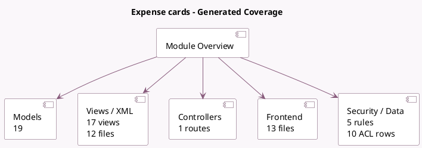

<!-- GENERATED:MODULE -->
---
tags: [odoo, enterprise, module]
---

# Expense cards

- Scope: Enterprise Addons
- Source: enterprise/hr_expense_stripe
- Dependencies: [[docs/Community Addons/hr_expense/hr_expense|hr_expense]], [[docs/Community Addons/certificate/certificate|certificate]]

## Summary

Create and manage company expense cards via Stripe

## Generated coverage

- Models: 19
- XML files with UI/data artifacts: 12
- Views: 17
- Actions: 2
- Menus: 2
- Rules (ir.rule): 5
- Access CSV entries: 10
- Controller units: 1
- Frontend asset files: 13

## Module map

## Detail notes

- Models: [[docs/Enterprise Addons/hr_expense_stripe/Models|Models]] (19)
- Views and XML: [[docs/Enterprise Addons/hr_expense_stripe/Views|Views]] (12 files)
- Controllers: [[docs/Enterprise Addons/hr_expense_stripe/Controllers|Controllers]] (1)
- Frontend: [[docs/Enterprise Addons/hr_expense_stripe/Frontend|Frontend]] (13 files)

## Key models

- `account.bank.statement.line`
- `account.chart.template`
- `account.journal`
- `account.payment`
- `account.payment.method.line`
- `account.payment.register`
- `hr.employee`
- `hr.expense`
- `hr.expense.split`
- `hr.expense.stripe.card`
- `hr.expense.stripe.card.block.wizard`
- `hr.expense.stripe.card.receive.wizard`

## Navigation

- [[../Enterprise Addons/Enterprise Addons|Back to scope]]
- [[../../docs/docs|Back to docs]]

<!-- GENERATED:MODULE -->

