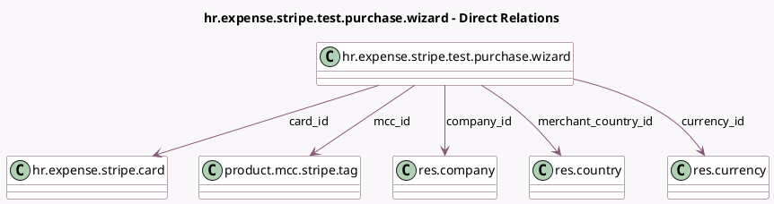

<!-- GENERATED:MODEL -->
---
tags: [odoo, enterprise, generated, model]
---

# hr.expense.stripe.test.purchase.wizard

- Module: [[docs/Enterprise Addons/hr_expense_stripe_demo/hr_expense_stripe_demo|hr_expense_stripe_demo]]
- Scope: Enterprise Addons
- Defined in module: yes
- Source files: `wizard/hr_expense_stripe_test_purchase_wizard.py`
- Python classes: `HrExpenseStripeTestPurchaseWizard`
- Description: Test Purchase Wizard for Stripe

## Field footprint

- Detected fields: 15
- Field types: `Boolean` x 3, `Char` x 1, `Many2one` x 6, `Monetary` x 4, `Selection` x 1
- Relation fields: 6

## Sample fields

- `amount_currency`: `Monetary`
- `atm_fee`: `Monetary`
- `authorization_method`: `Selection`
- `capture`: `Boolean`
- `capture_surcharge`: `Monetary`
- `card_currency_id`: `Many2one` (related `card_id.currency_id`)
- `card_id`: `Many2one` (comodel `hr.expense.stripe.card`)
- `cashback_amount`: `Monetary`
- `company_id`: `Many2one` (comodel `res.company`)
- `currency_id`: `Many2one` (comodel `res.currency`)
- `force_capture`: `Boolean`
- `mcc_id`: `Many2one` (comodel `product.mcc.stripe.tag`)
- `merchant_country_id`: `Many2one` (comodel `res.country`)
- `merchant_name`: `Char`
- `split_capture`: `Boolean`

## Method hints

- Detected methods: 1
- Action methods: `action_test_purchase`
- Compute methods: none
- Onchange methods: none

## Direct relation diagram

## Navigation

- **Parent:** [[docs/Enterprise Addons/hr_expense_stripe_demo/Models]]

<!-- GENERATED:MODEL -->
