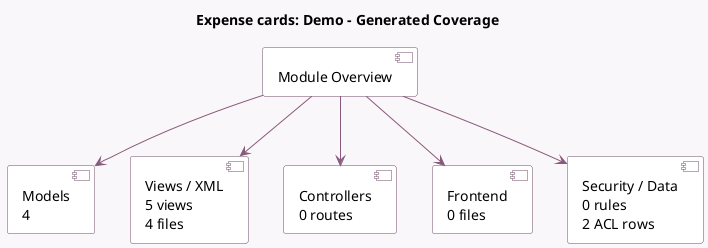

<!-- GENERATED:MODULE -->
---
tags: [odoo, enterprise, module]
---

# Expense cards: Demo

- Scope: Enterprise Addons
- Source: enterprise/hr_expense_stripe_demo
- Dependencies: [[docs/Enterprise Addons/hr_expense_stripe/hr_expense_stripe|hr_expense_stripe]]

## Summary

Create and manage company expense cards via Stripe: Demo

## Generated coverage

- Models: 4
- XML files with UI/data artifacts: 4
- Views: 5
- Actions: 0
- Menus: 0
- Rules (ir.rule): 0
- Access CSV entries: 2
- Controller units: 0
- Frontend asset files: 0

## Module map

## Detail notes

- Models: [[docs/Enterprise Addons/hr_expense_stripe_demo/Models|Models]] (4)
- Views and XML: [[docs/Enterprise Addons/hr_expense_stripe_demo/Views|Views]] (4 files)

## Key models

- `hr.expense.stripe.card`
- `hr.expense.stripe.test.purchase.wizard`
- `hr.expense.stripe.test.shipping.wizard`
- `hr.expense.stripe.topup.wizard`

## Navigation

- [[../Enterprise Addons/Enterprise Addons|Back to scope]]
- [[../../docs/docs|Back to docs]]

<!-- GENERATED:MODULE -->

